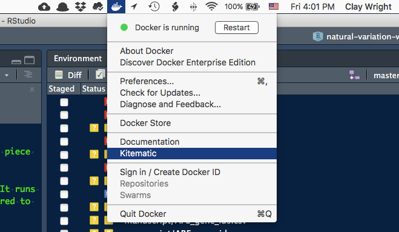
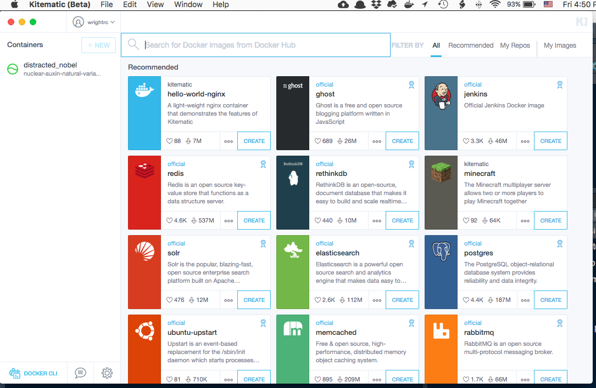
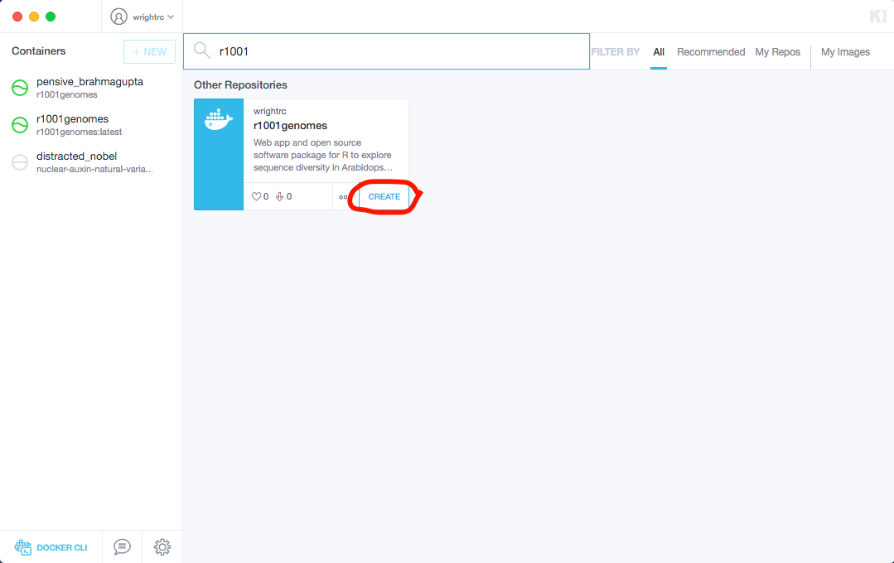
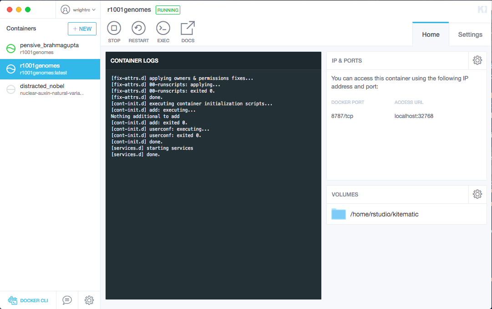
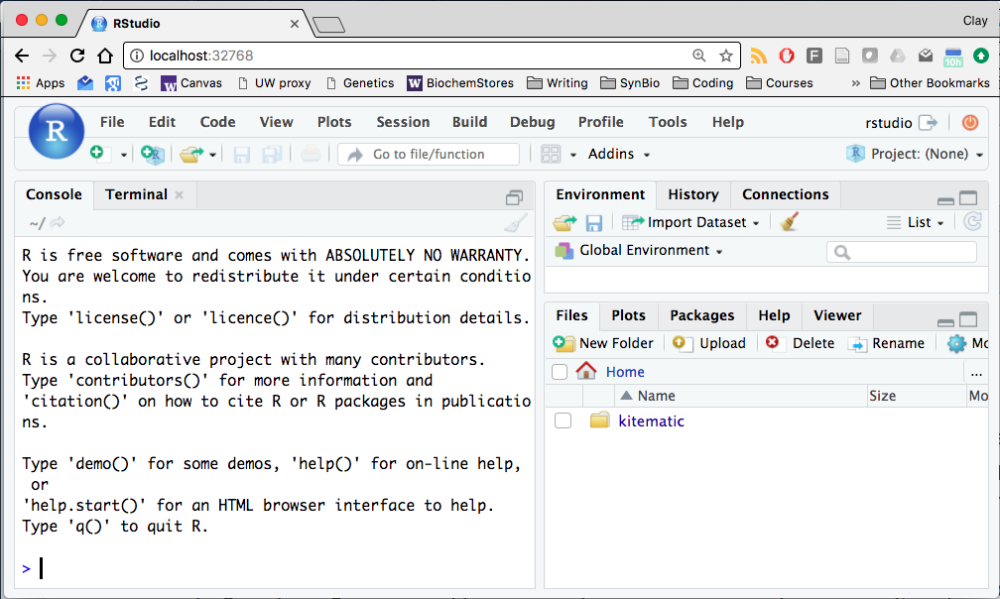
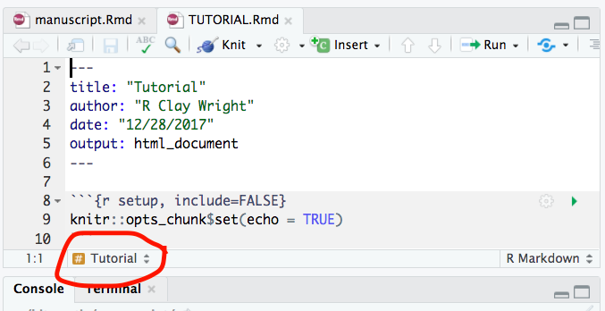
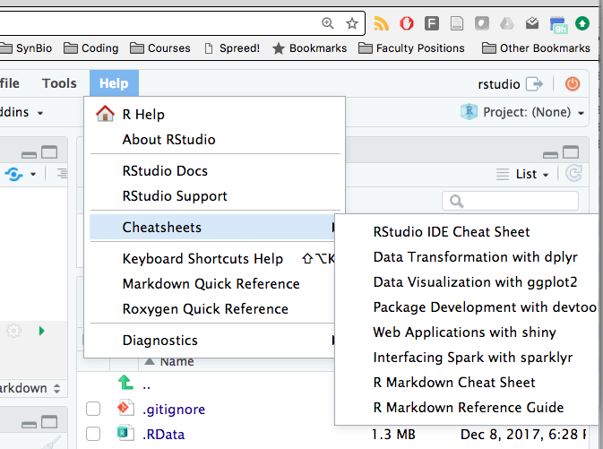
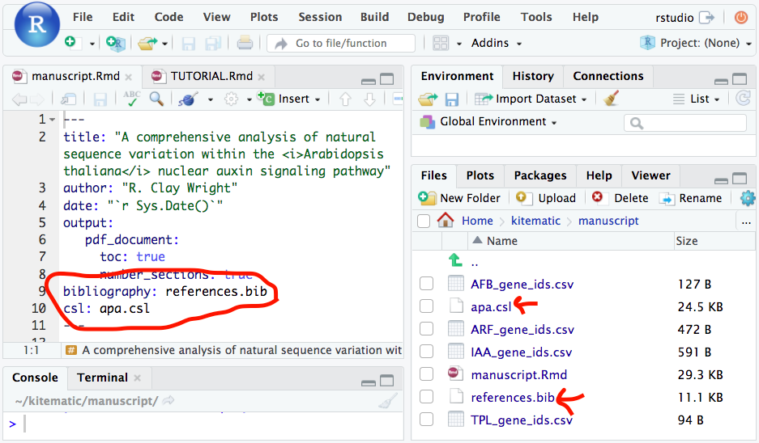

```{r setup, include=FALSE}
knitr::opts_chunk$set(echo = TRUE)
```

<!--This is a CSS (Cascading Style Sheet).
It controls how panels and images are formatted.></!-->
<style>
  img {
    display: block;
    margin: auto;
    width: 90%;
    height: auto;

  }
</style>


This tutorial will (hopefully) gently guide you through how to use the tools docker and Rmarkdown to analyze the natural variation in your set of genes and collaborate on our manuscript, tentatively titled: *A comprehensive analysis of natural sequence variation within the Arabidopsis thaliana nuclear auxin response pathway* (running title: " natural variation in the nuclear auxin response"). I assume that you have a basic working knowledge of how to download and install software as well as R and RStudio, 
but if you feel you could use a refresher check out [this introduction](https://github.com/wrightrc/Intro_to_R_RStudio_and_ANOVA). We'll use docker to share with you a version of R and Rstudio that already has all of the necessary packages to do the analysis. We'll use Rmarkdown to write the manuscript and make figures and tables by integrating prose, R code and results from the code. 

So in this tutorial I will guide you through, in as abstracted a way as possible:  
1. Installing docker  
2. Starting the version of RStudio in docker  
3. Working in docker/RStudio  
4. Saving your work in docker/RStudio  
5. Using Rmarkdown to format text  
6. Using Rmarkdown to insert R code and results into text  
7. Citations in Rmarkdown  

If you have any troubles with anything, find something unclear or even find a typo please email me and/or make the change in your version of these documents and I will integrate them in the next version.  
 
Ready to get started?  

## docker  

Docker is a program that allows software configurations to be shared across computers and time. We'll use docker to share the RStudio configuration that will allow you to run the `r1001genomes` package and shiny app without having to upgrade your computer, your R and Rstudio or deal with installing the packages `r1001genomes` depends on. Docker is kind of like a virtual machine that you may have used in the past to run Windows on your Mac or *visa versa*, but docker is better, faster, stronger than virtual machines.  

First things first, let's install docker!  

### Installing docker  
  
Docker requires a 64bit processor and operating system. For Macs, you can check your processor by clicking the "apple" in the menu bar and selecting "About this Mac". If "Processor" says Core Duo, you unfortunately have a 32 bit processor, otherwise anything else is a new 64bit processor. On a machine running Windows, go to the start menu and settings, then click on "System" and finally "About". If under "System type" you see "32-bit operating system,..." you can't install docker. If you see "32-bit operating system, x64-based processor", you *can* update Windows to 64-bit and then install docker, but this update requires a clean install, meaning all of your files will be deleted. 

Anyway, if you have 32-bit woes let me know and we'll come up with a way to allow you to collaborate. I've installed docker on the Macs in the lab so you can always work those.
  
#### Mac  
If you are using a 2010 or newer Mac with OS X Yosemite (10.10) or newer you can simply [download the Community Edition of docker](https://download.docker.com/mac/stable/Docker.dmg)(click the link to begin download) and install it. 

If you are using an older Mac or OS you will need to install the older [docker Toolbox](https://download.docker.com/mac/stable/DockerToolbox.pkg)(click the link to begin download). [Follow these directions](https://docs.docker.com/toolbox/toolbox_install_mac/) to help you get everything installed.

#### Windows  
If you are using Windows 10 Pro, Enterprise or Education you can simply [download the Community Edition of docker](https://download.docker.com/win/stable/Docker%20for%20Windows%20Installer.exe)(click the link to begin download) and install it.   

If you are using an older version of Windows you will need to install the older [docker Toolbox](https://download.docker.com/mac/stable/DockerToolbox.pkg)(click the link to begin download). [Follow these directions](https://docs.docker.com/toolbox/toolbox_install_windows/) to help you get everything installed.

### Using docker

Before we jump in let's learn some docker vocabulary. The initial software setup that is a stable snapshot and can be shared is called an "image". Whenever you run that image, you create a "container", which is just an instance of that container. From the docker website: 

>An **image** is a lightweight, stand-alone, executable package that includes everything needed to run a piece of software, including the code, a runtime, libraries, environment variables, and config files.  
>  
>A container is a runtime instance of an image—what the image becomes in memory when actually executed. It runs completely isolated from the host environment by default, only accessing host files and ports if configured to do so.

So I have shared with you (and the rest of the world actually) the docker image that will allow you to easily run the r1001genomes package and Shiny app. When you run that image you will create your own container of that image that you can do work in, change settings, build on, save or erase. 

Docker has recently built a graphical interface for managing images and containers called kitematic. We'll use this to simplify setting up your container from the image and allowing you to transfer files to and from the container.

#### Installing kitematic

If you click on the docker icon in the menu bar you will see kitematic listed as an option.  
  
Select "Kitematic" to open a window with a link to download and install kitematic. Once you have installed kitematic selecting the "Kitematic" link will open the kitematic interface.  
  
The containers that you currently have running on your system are listed in the left panel. You can see I have a "nuclear-auxin-natural-variation" container running, that docker has given the creative name "distracted-nobel". In the main pane of kitematic there are several popular images that we can create new containers from. 

The image that we are going to work with here is called `r1001genomes`. Docker images build from previous images (like all programming does, and science for that matter). I built the `r1001genomes` image on top of a previous image called `verse` from the `rocker` project. The `verse` image contains R, Rstudio, the [tidyverse](www.tidyverse.org) packages, Rmarkdown and all of the dependencies for these things. To this, I added  the necessary packages that `r1001genomes` builds from and `r1001genomes`. Let's make a new container for this image!

You can search in the box at the top of kitematic for "r1001genomes", then click "create" to download the image and create a container. This will take a **while**. You are downloading linux, R, Rstudio and all of those packages. Fortunately docker will reuse all of these components whenever you download a related image.  

  
Once the image is downloaded and the container is created you'll see a log and some other information "IP & PORTS" and "VOLUMES".  
 

  
As it says: "You can access this container using the following IP address and port". This means that if you point your browser to the "ACCESS URL" you will see the version of Rstudio that we've built.  

Go ahead give it a try!  
  
Now we need some data to play with in our Rstudio container! You'll notice that the only folder available in the "Files" pane is "kitematic", which matches the folder in the "VOLUMES" pane back in kitematic. To make use of this folder we need to map it to a folder on our computer. Click on the "gear" settings icon in the "VOLUMES" pane, then click "CHANGE" and select a folder to be able to access it within your container. Go ahead and select the "natural-variation-webtool" folder that this tutorial is in.  

Kitematic will then restart the container and the access URL might be changed. So go back to the "Home" tab and paste the new URL into your browser or, if the access URL didn't change, reload the page.  

Now when you click on the "kitematic" folder you will see the contents of this folder. Set the working directory to the "manuscript" folder (using code, or the "More" button). Click on "manuscript.Rmd" to open the manuscript markdown file.  

Time for some R markdown!

## R Markdown

The idea behind markdown and R markdown was to make html (hyper-text markUP language) more low key. So the goal of markDOWN, is to be easy to write and easy to read but still have a lot of the powers of HTML (text formatting, layout and templating). 

This document was is actually written in R Markdown. If you haven't already, open the "code" markdown version of this document ("TUTORIAL.Rmd") in Rstudio, and navigate down to the "R Markdown" section using the navigation bar at the bottom of the "Source" pane.  


You can follow along with the code and the document side-by-side to learn how markdown text formatting works. Here's some example markdown from the R markdown file template. 

Markdown is a simple formatting syntax for authoring HTML, PDF, and MS Word documents. For more details on using R Markdown see <http://rmarkdown.rstudio.com>.

When you click the **Knit** button a document will be generated that includes both content as well as the output of any embedded R code chunks within the document. You can embed an R code chunk like this:

```{r cars}
summary(cars)
```

### Including Plots

You can also embed plots, for example:

```{r pressure, echo=FALSE}
plot(pressure)
```

Note that the `echo = FALSE` parameter was added to the code chunk to prevent printing of the R code that generated the plot.

Don't get bogged down in formatting the text, but I would highly recommend checking out the "more details" link above and don't miss the [cheatsheet](http://rmarkdown.rstudio.com/lesson-15.html)! You can also find this and other cheatsheets and a Markdown reference in the RStudio "Help" menu. Focus foremost should be on the content. We'll worry about formatting in revisions.
  

In the manuscript skeleton and the example analysis you can also see some examples of how to use R markdown, DT (data table) and kable to format and insert tables into our document.  

### Citations in R markdown  
You can include citations in markdown documents using the following syntax: `[@citation_key]`. The citation key refers to the unique identifier generated when exporting a bibliography from a reference manager. For the manuscript you will need to export the references from your reference editor in one of many formats, but I would recommend BibTex (.bib). For other formats see [the markdown documentation](http://rmarkdown.rstudio.com/authoring_pandoc_markdown.html#citations).  

Let's take a look at an example, open the "references.bib" file in the "manuscript folder". You'll notice each reference begins with an @-symbol and the type of reference. Then within curly braces are all of the data about the reference. The first item is the citation key, which in this case is "gray_identification_1999". So to cite this paper in markdown you would add `[@gray_identification_1999]` to the end of a sentence. My process for citing-while-writing is to first write, then when I want to cite something, find the paper in my reference manager and copy it to a folder for the project I'm working on. This will allow me to export the folder as a .bib file later). Then I copy the citation key for the reference and paste it into my writing. When I'm ready to knit the document, I'll export the folder of references as a .bib (with Better Bibtex you can sync this file so that it is automatically updated). This bibliography file must be in the same folder with the .Rmd file, along with a .csl file that specifies the format of the citations and bibliography in the final document (available for most journals [via Zotero](https://www.zotero.org/styles)). These files also must be specified in the header of the document.  
  

Most common reference managers allow you to export a bibliography as a bibtex file, and copy and paste citation keys, however I would highly recommend downloading [Zotero](www.zotero.org) and importing your reference library from whatever reference editor you currently use. Zotero is free, open-source and integrates very well with all popular web browsers and writing tools. If you want to work in a different citation manager, here are some links to help you create and copy and paste citation keys as well as export BibTex bibliography files. Note that most of these tutorials are for Latex, which uses a slightly different syntax from Rmarkdown. In Rmarkdown insert citations via `[@citation_key]`. The `citation_key` string does have some stipulations 
>The citation key must begin with a letter, digit, or \_, and may contain alphanumerics, _, and internal punctuation characters (:.#$%&-+?<>~/).  

*To insert multiple citations separate the two citations by semicolons, e.g.* `Blah blah [@smith04; @doe99].`

[Endnote](https://www.reed.edu/cis/help/LaTeX/EndNote.html): Export as [bibtex with labels](http://www.endnote.com/downloads/style/bibtex-export-using-en-label-field).  
Endnote seems to have some issues generating unique citation keys for each reference. It might be best to export your library as an Endnote XML and import the whole thing into Zotero, if you have issues with the above solutions.  
[Mendeley](https://blog.mendeley.com/2011/10/25/howto-use-mendeley-to-create-citations-using-latex-and-bibtex/)  
[Zotero](https://github.com/bbest/rmarkdown-example#writing-with-rmarkdown)  

Once you are done writing and citing and have exported your BibTex file, you can add your bibliography file to the manuscript folder and add the name of your file to the document header (comma separated). This should allow your version of the manuscript to knit, with perhaps some errors if there are duplicate citation keys. Don't worry we'll sort out duplicates later, once I have merged everyones sections' together. 

#### Also print out your key citations and we will make a binder for everyones use in the computer room! Also don't forget to send me any changes or suggestions you have for this tutorial.

Thanks and happy collaborative writing!


