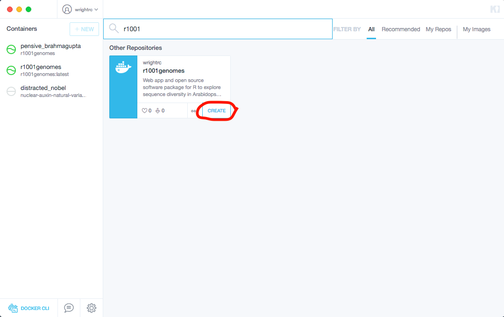
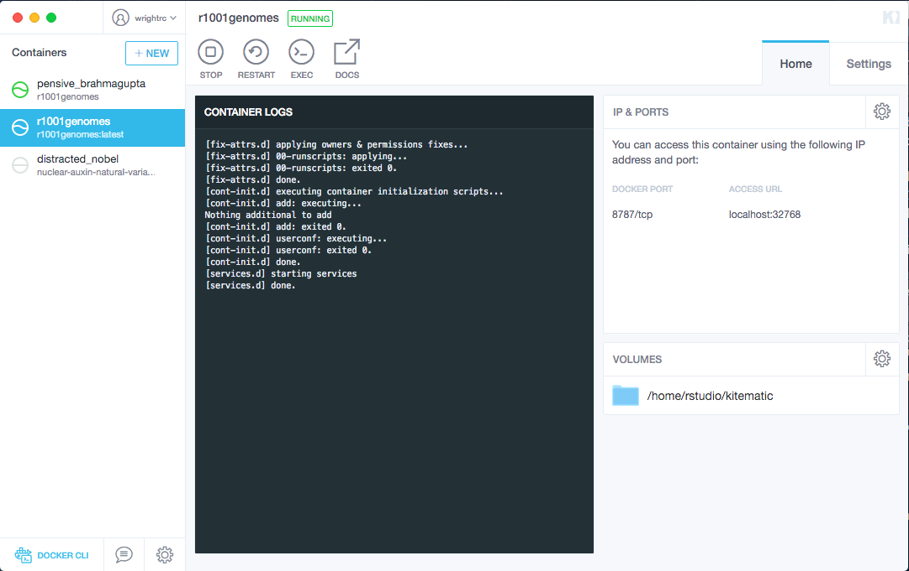
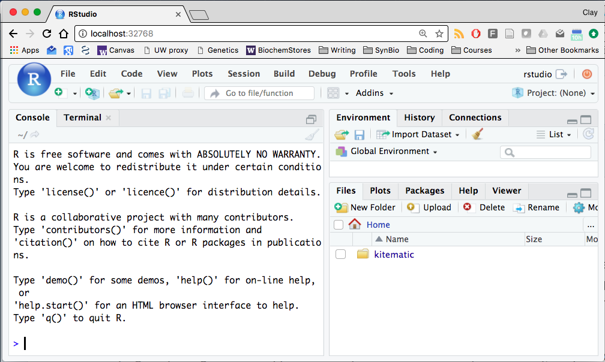
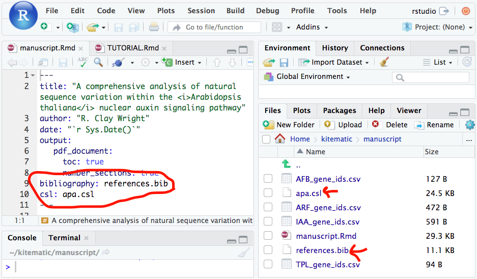

```{r, echo = FALSE, message=FALSE, warning=FALSE}
knitr::opts_chunk$set(warning = FALSE, collapse = TRUE, comment = "#>", tidy = TRUE, out.width = "90%", fig.height=4, fig.width=7, out.extra='style="margin: auto; display: block; padding-top: 15px;"')
library(r1001genomes)
library(DT)
library(dplyr)
library(reshape2)

```

<style>
  .using-app-insert {
     background-color: #bfbfbf;
     padding: 15px;
     border-style: solid;
     border-color:  #8c8c8c;
     border-radius: 7px 7px 0 0;
     border-width: 1px;
  }
  
  .using-R-insert {
     background-color: #e6e6e6;
     padding: 15px;
     border-style: solid;
     border-color:  #8c8c8c;
     border-radius: 0 0 7px 7px;
     border-width: 1px;
     border-top: 0;
  }  
  
  
  .using-app-insert h2, .using-app-insert h3, .using-app-insert h4 {
     border-bottom: 0;
  }
  
  .using-R-insert h2, .using-R-insert h3, .using-R-insert h4 {
     border-bottom: 0;
  }
  
  img {
    display: block;
    margin: auto;
    width: 90%;
    height: auto;

  }
</style>


# Introduction

This web app and open source software package for the R programming language was built to facilitate exploration of the naturally occurring sequence diversity for your favorite gene or gene family. We hope this product will help plant biologists without bioinformatics experience access the 1001 genomes project’s rich catalog of natural variation, formulate hypotheses and identify new interesting alleles in their favorite gene family.

The 1001 genomes dataset was collected with the intention of genome scale analyses, such as genome wide association studies, in which a particular phenotype is quantified for all of the accessions and sequence variants that are associated with phenotypic variation are identified. [In recent work](https://doi.org/10.1534/genetics.117.3000), we have utilized this rich dataset in a different manner to measure the effects of coding sequence variation on protein functional variation and phenotypic variation. This work has expanded the sequence-function-phenotype map for the auxin-signaling F-box gene family, and this product will facilitate similar analysis other genes, gene families, and genomic regions.

So pick out your favorite gene, gene family or genomic region and follow the steps in this guide to analyze how it varies in plants collected from all over the world. For this example we will be using the auxin-signaling F-box genes, *TIR1* and *AFB2* which have the TAIR locus IDs [AT3G62980](https://www.arabidopsis.org/servlets/TairObject?id=39952&type=locus) and [AT3G26810](https://www.arabidopsis.org/servlets/TairObject?id=38086&type=locus). Click on one of the previous links to search TAIR for the TAIR IDs of your favorite genes.

***
Before digging into the data, make some hypotheses about what genes, domains and/or positions in your 
favorite gene family might be under different evolutionary pressures. We can make some inferences about the evolutionary pressure acting on particular genes based on the sequence and geographic diversity observed in the 1001 genomes dataset. Thomas Mitchell-Olds and Johanna Schmitt published an excellent overview of the evolutionary inference from natural genetic diversity in *A. thaliana* [@mitchell-olds_genetic_2006]. We can calculate genetic diversity as the average number of nucleotide differences per site between two DNA sequences in all possible pairs in the sample population, and is denoted by $\pi$. 

However, evolutionary pressures potentially exert influence across all levels of biology, nucleotides, genes, genomes, phenotypes, organisms and populations.  This makes any inference from study of genetic diversity contingent on potentially unknown effects of epistasis between genes, population structure, environment, and many other effectors. Additionally, as an agricultural tag-along, much of the genetic variation in *A. thaliana* is due to admixture between populations as the result of human influence migration. So keep in mind throughout this analysis the limitations of examining a single snapshot in time of a potentially biased collection of frequently self-fertilizing organisms that were dispersed by human migration. Because of these limitations, inferring theories about how evolutionary forces are acting on your favorite genes is very uncertain business. However, if we assume a few things we can make some speculations.  

Assumptions:  
1. Polymorphisms in the dataset are not *completely* detrimental to organismal fitness.  
2. Most nonsynonymous polymorphisms in a gene result in a reduction in function.  

Now, taking a gene-centric view of evolution, here are some of the evolutionary pressures, or types of natural selection, that we might observe: 


### Purifying selection  
If a gene's sequence is highly conserved (low diversity) it may be under [purifying/negative/stabilizing selection](https://en.wikipedia.org/wiki/Negative_selection_(natural_selection)). 
If a genes' function is crucial to the fitness of the organism, and most polymorphisms result in loss of function, we would expect a low level of nonsynonymous polymorphism in this gene. This is because deleterious polymorphisms that do arise in this gene within the population will be outcompeted by the more-fit parent. This results in the decreased genetic diversity in genes under purifying selection.  


### Genetic Drift
If evolutionary pressure is very weak on a gene its sequence might change with no effect on organismal fitness. This allows a gene to accumulate many mutations that may persist in the population or be lost at random. This results in random fluctuations in allele frequencies, which when combined with an appreciable rate of mutation and a sufficient population size yields increased genetic diversity in the population.   

Beyond purifying selection and drift it is very difficult to make any strong inferences on the population as a whole. However there are two more types of selective pressure, balancing or neutral selection and positive or directional selection.

### Balancing selection
Genes of high diversity may be under balancing selection, also called neutral divergence. Balancing selection maintains multiple variants for long evolutionary times because different alleles provide selective advantages in different environments or genetic backgrounds. This results in high diversity at the particular site under selection and increased diversity at closely linked neutral sites due to genetic hitchhiking with this allele under balancing selection.  
  
### Directional selection  
If a polymorphism (or allele) is associated with a phenotype that provides an organism with a fitness advantage this phenotype and associated allele may be experiencing directional or positive selection. Positive/directional selection results in an increase in the prevalence of the advantageous allele within the population over time. Directional selection is one of the most difficult things to infer and is a very active area of research. Directional selection, like stabilizing selection is associated with reduced genetic diversity within the population under selection. However, unlike stabilizing selection the gene under directional selection will potentially have two major alleles that provide adaptive potential to different environments or genetic backgrounds.   


# Hypothesize
Now go read/collect the literature about your family and make some hypotheses!  
Here are some questions to help you get started:  

What structure/function knowledge is there?  
What is each domain in the protein doing?  
Are there any positions that are of vital importance?  
  
Is there a published protein sequence alignment of your gene family?  
What positions in the protein family are highly conserved?  
What positions are highly variable?  

Is there a published phylogenetic tree of your gene family?  
What are the most recently duplicated sister gene pairs?  
What do you know about the phenotypes of mutants in these pairs?  
Do the genetics suggest these pairs are redundant?  
  
  
## For example
In TIR1 and AFB2 there are 2 domains. The F-box domain interacts with the SCF components [@gray_identification_1999], and the LRR domain binds auxin and Aux/IAA proteins [@kepinski_auxininduced_2004]. The F-box is roughly 40 amino acids and wraps tightly around the SKP1 component of the SCF complex. The LRR is greater than 500 amino acids and binds auxin in a pocket formed by a horseshoe shaped chain of LRRs [@tan_mechanism_2007]. The outside of this horseshoe shape does not have any known interactions other than a dimerization interface [@dezfulian_oligomerization_2016]. Because the F-box domain must interact with the SCF complex for TIR1/AFB2 to perform their known function, we might expect the F-box to be highly conserved. The small size of the F-box also helps strengthen this hypothesis. The LRR domain is much larger and may have differing specificities for Aux/IAAs, so we might expect it to be more diverse. 
We would also expect the residues of the LRR that contact auxin and the Aux/IAA degron to be highly conserved. 

## Creating annotations 

We can build a table of all of these structure function annotations in Excel as a CSV or within R. For the AFBs we will annotate the protein domains and a micro RNA binding site. 

```{r}
# create matrix for F-box/LRR division in the coding sequence (CDS), 
#  based on Tan et al. supplementary alignment 
domains<-matrix(data = c(c(1,1,1,1,151,151,1), # Fbox start in CDS
                         3*c(51,47,46,46,96,96,58), # Fbox end in AA * 3 = CDS 
                         3*c(51,47,46,46,96,96,58)+1, # LRR start 
                         c(1785,1758,1728,1734,1872,1860,1779)), # LRR end 
             nrow = 4, ncol = 7, byrow = TRUE, 
             dimnames = list(c('Fbox_start', 'Fbox_end', 
                               'LRR_start', 'LRR_end'), 
                           c("TIR1","AFB1","AFB2", "AFB3",
                             "AFB4", "AFB5", "COI1")))

#create columns for miR393
miR393_start <- c(1519,1507,1504,1510,1657,1657,1551)
miR393_end <- miR393_start+18

# bind these columns to the domains
domains<-rbind(domains,miR393_start,miR393_end)

# convert to a data frame and convert values to AA numbering from CDS
domains <- as.data.frame(t(round(domains/3))) 
#domains
write.csv(domains, "manuscript/annotations_wide.csv")
```
  
You can used the `annotations_wide.csv` file as a basis to build annotations for your gene family. However because we can make alignments of our genes because they are so closely related it is not necessary to create an annotation for each gene in you family. Also this wide format doesn't make much sense if we are trying to annotate something unique to one gene. Instead I would recommend using a long format annotation. This will also make plotting these annotation on top of plots and alignments later much easier. Here is how we can convert the wide format annotation data frame into a long format.

```{r}
# create a column for the genes, which are currently the row names 
domains$gene <- row.names(domains)

# We'll order the gene names so that they will always be plotted in the 
# conventional order
domains$gene <- factor(x= domains$gene, levels = c('TIR1','AFB1','AFB2','AFB3','AFB4','AFB5','COI1'), ordered = T)

# Now we'll use melt() from the reshape2 package to "melt" the data frame into 
# long format. It's best to look at the output to figure out what melt does.
domains_long <- reshape2::melt(data = domains, 
                               id.vars = "gene", 
                               variable.name = "annotation", # column name for 
                               # all of the column names in the wide format
                               value.name = "position") # what is the name 
                               # of all of the values in the table
domains_long

# Let's add another column to indicate that these annotations are for 
# amino acid positions
domains_long$position_type <- "AA"
#write.csv(domains_long, "manuscript/annotation_long.csv")
```

I would use this `annotation_long.csv` to keep track of the structure/function information on individual genes you come across as you are reading the literature. Then you can map this information on top of the diversity plots and alignments that we will create below to see if these annotations apply to the whole family or just the single genes cited in the literature. 

***

# A note on the format of this document
<!--=========================================================================-->
<div  class="using-app-insert"><!--panel start--------------------------------->
## Using the App 


In addition to calling the functions of the r1001genomes package in R directly. There is also a GUI provided in the form of a Shiny app. This app can perform some of the analysis tasks the package is capable of performing, without the need to have knowledge of programming in R. 

In this vignette panels like this one are used to show examples of using the app to achieve similar results as using  the R function calls directly in this vignette. Screenshots will usually be provided to make it clear what section or tab we are talking about  

```{r, echo = FALSE}

knitr::asis_output("
                   ") # This newline required for headings to render after image
```
## Starting the web app

To start the Shiny app, run the following command:
```{r, eval=FALSE}
run1001genomes()
```
The app should appear in a new window, and look similar to the image above.
</div><!--panel end------------------------------------------------------------>
<div  class="using-R-insert"><!--panel start----------------------------------->
## Using R
In these lighter colored panels, the equivalent R code will be displayed.
</div><!--panel end------------------------------------------------------------>
<!--=========================================================================--> 


# Download the chromosome positions and gene models 
The first step in retrieving the natural variation in our genes is to retrieve the information about where the genes are in the genome of Col-0, the laboratory reference accession, and how the mRNA and coding sequence is laid out. This information is called the gene model.

<!--=========================================================================-->
<div  class="using-app-insert"><!--panel start--------------------------------->
## Loading Gene Data in the App
```{r, echo=FALSE}

knitr::asis_output("
                   ") # This newline required for headings to render after image
```
### Selecting Genes and Generating the Gene Model Table
At the top of the first tab (the "SNP Stats" tab) is a text input field where you can input a list of TAIR loci.

The app will download the gene model information as soon as you click submit. Copy and paste your TAIR loci in the box, separated by commas, and click submit.

The app may take a little while to process after clicking the submit button on the first tab, especially if you have a long list of genes, but once this process is complete on the first tab, the data for these genes will be already loaded for the subsequent tabs. 

Once the loading process has finished, the first table you should see scrolling down the SNP Stats tab is the Gene Information table. It should look similar to the table produced in the "Using R" section below.
</div><!--panel end------------------------------------------------------------>
<div  class="using-R-insert"><!--panel start----------------------------------->
## Using R
The code the app uses to download this table is the `getGeneInfo` function. This function is just a simplifying wrapper for the `BioMart` function `getBM`. This downloads the gene model from ENSEMBL plants.

```{r}
tair_ids <- c("AT3G62980", "AT3G26810")
geneInfo <- getGeneInfo(genes = tair_ids, firstOnly = TRUE, inputType = "tair_locus", useCache = TRUE)
```

Now we can give this table a look. We can also freshen up the table a bit with `datatable`. 
```{r}
datatable(geneInfo[, -c(5,6,9)], colnames = c("tair locus", "symbol", "transcript", 
                                              "Chr", "transcript \nstart", "transcript \nend", 
                                              "transcript \nlength"), rownames = FALSE, 
          options=list(paging=FALSE, searching=FALSE))
```
</div><!--panel end------------------------------------------------------------>
<!--=========================================================================-->

Do you have a spreadsheet of loci?  
  
Here is some quick code to make a text string you can copy and paste into the app gene input box.  
```{r}
AFB_loci <- read.csv(system.file("extdata", "AFB_gene_ids.csv", package = "r1001genomes"))
paste(AFB_loci$tair_locus, collapse = ",")
```

Occasionally there are multiple models for a single gene if there are multiple possible transcripts or splice variants. Does your gene have multiple models?


# Download the variants in the 1001 genomes dataset for these genes
The 1001 genomes dataset is stored as a VCF (Variant Call Format) file. This is 
a very efficient format for storing such a large dataset (the 1135 genomes are ~17gb), 
and for some analyses its matrix format is very useful. 

<!--=========================================================================-->
<div  class="using-app-insert"><!--panel start--------------------------------->
## Downloading and processing of VCFs in the App
Upon clicking the "Submit" button on the "SNP Stats" tab, the web app automatically creates a tidy dataframe and calculates the number of unique and nonunique polymorphisms in each region of the gene model as well as calculating the diversity in the protein coding sequence. The diversity is the average number of nucleotide differences per site between all possible pairs of sequences. Diversity is also calculated for only the set of synonymous and nonsynonymous polymorphisms.

The results of these calculations are displayed in the three tables below the Gene Information table.


</div><!--panel end------------------------------------------------------------>
<div  class="using-R-insert"><!--panel start----------------------------------->
## Using R
We can download a set of VCF files for our favorite genes using the `VCFList` function.

```{r, eval=FALSE}
YFG_VCF <- VCFList(geneInfo = geneInfo, by = "transcript", tidy = FALSE)
```

However, for some filtering, summarizing and plotting operations it is more efficient to 
convert the matrix into a very long data frame. Most of the functions in `r1001genomes` 
operate on a long data frame, often called a tidy data frame. We can automatically covert 
our VCF to a tidy data frame by setting the `tidy` argument to `TRUE`.

```{r, cache=TRUE}
YFG_VCF <- VCFList(geneInfo = geneInfo, by = "transcript", tidy = TRUE)
```

We now have a list of very long data frames with all the information on SNPs inside, but much of the details on the effects of these polymorphisms are contained in a single column labeled 'EFF' as a long text string, making it hard to filter and process the data by the individual attributes within that text string.
The `parseEFF` function will separate individual fields of the EFF string into separate columns on a single dataframe, and can be applied to our list of data frames with the `llply` function from the plyr package
```{r}
YFG_VCF <- llply(YFG_VCF, parseEFF)
```


To generate the three tables of polymorphism stats the app calls the function `polymorphRow`. In R we can do the same thing.
```{r, cache=TRUE}
#TIR1_AFB2_table <- polymorphTable(geneInfo = geneInfo, strains = strains)
YFG_VCF <- llply(YFG_VCF, Nucleotide_diversity)
TIR1_AFB2_table <- ldply(YFG_VCF, polymorphRow, geneInfo = geneInfo, .id = "Transcript_ID")

```

Before displaying this table we will again clean it up a bit.

```{r}
formatRound(datatable(TIR1_AFB2_table[,c(1:6,8)],
                  colnames = c("transcript", "5' UTR", "intron", "3' UTR",
                               "coding \n synonymous", "coding \n missense",
                               "coding \n total"), 
                  escape = FALSE, rownames = FALSE,
    options=list(paging=FALSE, searching=FALSE)), columns = 2:7, digits = 0)
```
The nucleotide diversity for the chosen genes is also calculated in the call to `polymorphTable`.

```{r}
formatRound(datatable(TIR1_AFB2_table[, c(1,13,9:12)],
                  colnames = c("transcript",
                               "&pi; transcript",
                               "&pi; coding",
                               "&pi;<sub>N</sub>",
                               "&pi;<sub>S</sub>",
                               "&pi;<sub>N</sub>/&pi;<sub>S</sub>"), 
                  escape = FALSE,
                  options = list(paging=FALSE, searching=FALSE)),
                columns = 1:6, digits = 6)
```


</div><!--panel end------------------------------------------------------------>
<!--=========================================================================-->

## Results
Do these values match your hypotheses? Is there anything unexpected?  
  
For our TIR1 and AFB2 example, we can make several interesting observations based on this dataset.  
1. *AFB2* had higher number of total polymorphisms than *TIR1*, across all subsets of sites except for introns. 
2. *AFB2* also has a higher total coding diversity and higher ratio of diversities at nonsynonymous to synonymous sites. 
  
This was expected, as *TIR1* mutants have a strong loss of auxin sensitivity whereas *AFB2* mutants have a much weaker effect. Therefore, polymorphisms in *TIR1* are much more likely to have an effect on phenotype than polymorphisms in *AFB2*. 
  
# Diversity within each gene  

Now we'll move on to the second "Diversity Plot" tab. This tab will calculate the diversity at each position within the coding sequence of each gene. In addition to calculating the nucleotide diversity of a whole sequence, like the transcript of a gene, we can also calculate the diversity statistic for each position along the reference genome. This could be useful if you suspect a particular region of your gene may be more important to function or more sensitive to nucleotide  or amino acid changes. 

<!--=========================================================================-->
<div  class="using-app-insert"><!--panel start--------------------------------->
## Diversity Plot
The second tab of the app, labeled "Diversity Plot" allows you to plot the nucleotide diversity for each of the genes you selected in the "SNP Stats" tab.  
```{r, echo=FALSE}
imagePath <- "Screenshots/Tab_2_Select_Gene.PNG"
knitr::include_graphics(imagePath)
knitr::asis_output("
                   ") # This newline required for headings to render after image
```
After clicking to the "Diversity Plot" tab, select the first gene you would like to plot then click the submit button.  
  

You should see a plot like the one above. The plot shows Nei's nucleotide diversity by *nucleotide position* of the protein coding region of the gene, though the X-axis is marked by codon number from the N-terminus for convenience. The symbols are differentiated by whether the site has a synonymous or missense variant. If multiple variant types are present at the same position, both markers will be plotted with a slight jitter, to prevent over plotting.  
  
Below the plot is a grey box. If you click and drag across some points in the plot, this will create a selection box. The data for the selected points will appear in the grey box.  
  
Below the plot is a data table with the data provided for all points on the plot. You can click the "Download Content..." button above the table to download a .csv file of this complete table.

</div><!--panel end------------------------------------------------------------>
<div  class="using-R-insert"><!--panel start----------------------------------->

## Using R
The app uses the function `getCodingDiv` to calculate the diversity stat at each nucleotide position of the coding sequence, then uses the function `plotCodingDiv` to plot that information for a single gene. 

```{r}
YFG_Coding_Diversity <- llply(YFG_VCF, getCodingDiv)
lapply(YFG_Coding_Diversity, plotCodingDiv)

```

</div><!--panel end------------------------------------------------------------>

## Results
Do these values match your hypotheses? Is there anything unexpected?  
In *AFB2* there are five alleles with diversity greater than 1E-2 and 20 alleles with diversity greater than 3E-3. *TIR1* has two alleles with diversity greater than 1E-2 and nine alleles with diversity greater than 3E-3. This high number of high frequency alleles in the population suggests that *AFB2* is more likely to be under drift or balancing selection relative to *TIR1* or that *TIR1* is under stronger purifying selection than *AFB2*. It is important to consider however that sampling bias in certain geographic populations could affect these hypotheses. To get some idea of if this is true we will look at the geographic distribution of these alleles.   


<!--================== TEMPLATE START =======================================-->
# Mapping the collection location of accessions by alleles   
As an initial visualization of the population structure that may be influencing the allele frequency and prevalence of alleles in a gene, we can map the collection locations from which the accessions were collected. If the accessions sharing a similar polymorphism are all closely clustered then it is likely several members of the same population derived from a common ancestor are represented. If there are many distantly located accessions sharing the same polymorphism this may result from human-associated migration and admixture or possibly from independent mutation events. In addition to these patterns, look for potential environmental gradients of particular alleles (e.g. is a particular allele only found above/below a certain latitude or only in coastal/desert environments?).

<!--=========================================================================-->
<div  class="using-app-insert"><!--panel start--------------------------------->
## SNP mapping
When you first click on the "SNP mapping" panel you will be faced with a choice of which genes you would like to map accessions for. Click in the checkboxes of the gene or genes you would like map variant accessions for and click submit. Now you can use the "Log nucleotide diversity filter limit" slider to set the minimum diversity of the alleles to map. You can also use the "Type of SNP to mark" radio buttons to select the type of SNPs you would like to show on your map.  
  
This slider and radio buttons will automatically update the list of alleles you can add to your map in the "Allele selection" section. Select any number of alleles and click "Update map" to highlight the location of the accessions containing these alleles on the map.  
  
This will reveal the map with accessions containing the selected alleles shown as colored transparent points. All other accessions will be shown as grey points.  
  
You can change the layering of the points, to remove the other (n/a) accessions or to plot one allele on top using the "Layers" button in the bottom left of the map. 

You can view the full list of accessions in the map along with the alleles those accessions contain directly below the map in the "Map Data" section. You can navigate through this datatable or search for particular alleles using the box at the top right. You can also download the contents of this datatable.


</div><!--panel end------------------------------------------------------------>
<div  class="using-R-insert"><!--panel start----------------------------------->
## Using R
To repeat the mapping of accessions in R, we will first have to filter by diversity the VCF of mutations. We also want to exclude the reference variants (i.e. when GT is 0|0). We'll use some tools from the [tidyverse](http://tidyverse.org/) to do this. 
```{r}
AFB2_missense <- YFG_VCF$AT3G26810.1 %>% 
  dplyr::filter(Diversity > 3*10^(-3) & gt_GT != "0|0" & 
                  Effect == "missense_variant")
head(AFB2_missense)
```
The accession (as ecotype ID) is in the "Indiv" column of this data frame. Now we will need to attach the accession name, latitude, longitude and other data to this data frame. We'll do this with the `addAccDetails` function. The metadata is also available as an included dataset in the r1001genomes package called `accessions`. 

```{r}
AFB2_missense <- labelBySNPs(AFB2_missense)
head(AFB2_missense)
```
Now we can plot the variants. In the app we use the Leaflet package to provide an interactive plot. We can also do this within R.
```{r}
#load the leaflet package 
library(leaflet)
AFB2_missense <- rbind(AFB2_missense[is.na(AFB2_missense$SNPs), ],
                       AFB2_missense[!is.na(AFB2_missense$SNPs), ])

    # make a field with text to be displayed when clicking on a marker
    AFB2_missense$popup <- paste("EcoID:",  AFB2_missense$Indiv,"Name:", AFB2_missense$Name, " SNPs:", AFB2_missense$SNPs)

    # create the color pallet for the map points
    pal <- RColorBrewer::brewer.pal(8, "Set1")
    pallet <- colorFactor(palette=pal, domain=AFB2_missense$SNPs)
map <- leaflet()
    map <- addProviderTiles(map, providers$Stamen.TonerLite,
                     options = providerTileOptions(noWrap = TRUE))

    # groupnames to be used by draw groups of points as separate layers below
    groupnames <- unique(AFB2_missense$SNPs)
    groupnames <- groupnames[!is.na(groupnames)]

    # add markers for NA points first so they are furthest back layer
    map <- addCircleMarkers(map, data=AFB2_missense[is.na(AFB2_missense$SNPs), ], color= "#9b9b9b", group="NA",
                            radius=6, stroke=FALSE, fillOpacity=0.6)

    # for each of the group names, add a set of markers
    for (SNP in groupnames){
          map <- addCircleMarkers(map, data=AFB2_missense[AFB2_missense$SNPs == SNP, ], color= ~pallet(SNPs), group= SNP,
                            radius=6, popup= ~popup, stroke=FALSE, fillOpacity=0.85)
    }

    # add the legend to the map
    map <- addLegend(map, position="bottomright", pal=pallet,
                     values=AFB2_missense$SNPs, title="Marker Colors", opacity=1)

    # add layer control to map to turn on or off groups of points
    map <- addLayersControl(map, overlayGroups=c(groupnames, "NA"),
                            options = layersControlOptions(collapsed = TRUE),
                            position="bottomleft")

    map
```
You can also use the `ggmap` function from the package of the same name to create maps. The "ggrepel" package also helps to handle overlapping labels.

```{r}
library(ggplot2)
library(ggmap)
library(ggrepel)

europe <- get_map(location = 'europe', zoom = 4)
michigan <- get_map(location = 'michigan', zoom = 5)


ggmap(europe) + xlab('longitude') + ylab('latitude') + geom_point(data = AFB2_missense, aes(x = Long, y = Lat), alpha = 0.5, shape = 18, color = "darkgrey") + geom_label_repel(data = subset(AFB2_missense, grepl(pattern = "204", AFB2_missense$SNPs)), mapping = aes(label = Name, x = Long, y = Lat), fill = "white", point.padding = unit(0.5, "lines"), segment.size = 1) 

ggmap(michigan) + xlab('longitude') + ylab('latitude') + geom_point(data = AFB2_missense, aes(x = Long, y = Lat), alpha = 0.5, shape = 18, color = "darkgrey") + geom_label_repel(data = subset(AFB2_missense, grepl(pattern = "516", AFB2_missense$SNPs)), mapping = aes(label = Name, x = Long, y = Lat), point.padding = unit(0.5, "lines"), segment.size = 1) 

```


</div><!--panel end------------------------------------------------------------>
<!--=========================================================================-->

# References


<!--================== TEMPLATE START =======================================--
# heading   
description

<!--=========================================================================--
<div  class="using-app-insert"><!--panel start---------------------------------
## Tab title
some text and picture

</div><!--panel end------------------------------------------------------------
<div  class="using-R-insert"><!--panel start-----------------------------------
## Using R
some text and code snippet
</div><!--panel end------------------------------------------------------------
<!--=========================================================================-->


<!--chapter:end:example.Rmd-->

---
title: "Collaborative analysis and writing in R"
author: "R Clay Wright"
date: "12/28/2017"
output: 
  html_document:
    toc: true

---

```{r setup, include=FALSE}
knitr::opts_chunk$set(echo = TRUE)
```

<!--This is a CSS (Cascading Style Sheet).
It controls how panels and images are formatted.></!-->
<style>
  img {
    display: block;
    margin: auto;
    width: 90%;
    height: auto;

  }
</style>


This tutorial will (hopefully) gently guide you through how to use the tools docker and Rmarkdown to analyze the natural variation in your set of genes and collaborate on our manuscript, tentatively titled: *A comprehensive analysis of natural sequence variation within the Arabidopsis thaliana nuclear auxin response pathway* (running title: "natural variation in the nuclear auxin response"). I assume that you have a basic working knowledge of how to download and install software as well as R and RStudio, 
but if you feel you could use a refresher check out [this introduction](https://github.com/wrightrc/Intro_to_R_RStudio_and_ANOVA). We'll use docker to share with you a version of R and Rstudio that already has all of the necessary packages to do the analysis. We'll use Rmarkdown to write the manuscript and make figures and tables by integrating prose, R code and results from the code. 

So in this tutorial I will guide you through:  
1. Installing docker  
2. Starting RStudio and r1001genomes in docker  
3. Working in docker/RStudio  
4. Saving your work in docker/RStudio  
5. Using Rmarkdown to format text  
6. Using Rmarkdown to insert R code and results into text  
7. Citations in Rmarkdown  

If you have any troubles with anything, find something unclear or even find a typo please email me and/or make the change in your version of these documents and I will integrate them in the next version.  
 
Ready to get started?  

## Docker  

Docker is a program that allows software configurations to be shared across computers and time. We'll use docker to share the RStudio configuration that will allow you to run the `r1001genomes` package and shiny app without having to upgrade your computer, your R and Rstudio or deal with installing the packages `r1001genomes` depends on. Docker is kind of like a virtual machine that you may have used in the past to run Windows on your Mac or *visa versa*, but docker is better, faster, stronger than virtual machines.  

First things first, let's install docker!  

### Installing docker  
  
Docker requires a 64bit processor and operating system. For Macs, you can check your processor by clicking the "apple" in the menu bar and selecting "About this Mac". If "Processor" says Core Duo, you unfortunately have a 32 bit processor, otherwise anything else is a new 64bit processor. On a machine running Windows, go to the start menu and settings, then click on "System" and finally "About". If under "System type" you see "32-bit operating system,..." you can't install docker. If you see "32-bit operating system, x64-based processor", you *can* update Windows to 64-bit and then install docker, but this update requires a clean install, meaning all of your files will be deleted. 

Anyway, if you have 32-bit woes let me know and we'll come up with a way to allow you to collaborate. I've installed docker on the Macs in the lab so you can always work those.
  
#### Mac  
If you are using a 2010 or newer Mac with OS X Yosemite (10.10) or newer you can simply [download the Community Edition of docker](https://download.docker.com/mac/stable/Docker.dmg)(click the link to begin download) and install it. 

If you are using an older Mac or OS you will need to install the older [docker Toolbox](https://download.docker.com/mac/stable/DockerToolbox.pkg)(click the link to begin download). [Follow these directions](https://docs.docker.com/toolbox/toolbox_install_mac/) to help you get everything installed.

#### Windows  
If you are using Windows 10 Pro, Enterprise or Education you can simply [download the Community Edition of docker](https://download.docker.com/win/stable/Docker%20for%20Windows%20Installer.exe)(click the link to begin download) and install it.   

If you are using an older version of Windows you will need to install the older [docker Toolbox](https://download.docker.com/mac/stable/DockerToolbox.pkg)(click the link to begin download). [Follow these directions](https://docs.docker.com/toolbox/toolbox_install_windows/) to help you get everything installed.

### Using docker

Before we jump in let's learn some docker vocabulary. The initial software setup that is a stable snapshot and can be shared is called an "image". Whenever you run that image, you create a "container", which is just an instance of that container. From the docker website: 

>An **image** is a lightweight, stand-alone, executable package that includes everything needed to run a piece of software, including the code, a runtime, libraries, environment variables, and config files.  
>  
>A **container** is a runtime instance of an image—what the image becomes in memory when actually executed. It runs completely isolated from the host environment by default, only accessing host files and ports if configured to do so.

So I have shared with you (and the rest of the world actually) the docker image that will allow you to easily run the r1001genomes package and Shiny app. When you run that image you will create your own container of that image that you can do work in, change settings, build on, save or erase. 

Docker has recently built a graphical interface for managing images and containers called kitematic. We'll use this to simplify setting up your container from the image and allowing you to transfer files to and from the container.

#### Installing kitematic

If you click on the docker icon in the menu bar you will see kitematic listed as an option.  
  
Select "Kitematic" to open a window with a link to download and install kitematic. Once you have installed kitematic selecting the "Kitematic" link will open the kitematic interface.  
  
The containers that you currently have running on your system are listed in the left panel. You can see I have a "nuclear-auxin-natural-variation" container running, that docker has given the creative name "distracted-nobel". In the main pane of kitematic there are several popular images that we can create new containers from. 

The image that we are going to work with here is called `r1001genomes`. Docker images build on previous images (like all programming does, and all science does, for that matter). I built the `r1001genomes` image on top of a previous image called `verse` from the `rocker` project. (The rocker project and R Open Science also have a [great docker tutorial](http://ropenscilabs.github.io/r-docker-tutorial/).) The `verse` image contains R, Rstudio, the [tidyverse](www.tidyverse.org) packages, Rmarkdown and all of the dependencies for these things. To this, I added  the necessary packages that `r1001genomes` builds from and `r1001genomes`. Let's make a new container for this image!

You can search in the box at the top of kitematic for "r1001genomes", then click "create" to download the image and create a container. This will take a **while**. You are downloading linux, R, Rstudio and all of those packages. Fortunately docker will reuse all of these components whenever you download a related image.  

  
Once the image is downloaded and the container is created you'll see a log and some other information "IP & PORTS" and "VOLUMES".  
 

  
As it says: "You can access this container using the following IP address and port". This means that if you point your browser to the "ACCESS URL" you will see the version of Rstudio that we've built. The username and password are both "rstudio".   

Go ahead give it a try!  
  
Now we need some data to play with in our Rstudio container! You'll notice that the only folder available in the "Files" pane is "kitematic", which matches the folder in the "VOLUMES" pane back in kitematic. To make use of this folder we need to map it to a folder on our computer. Click on the "gear" settings icon in the "VOLUMES" pane, then click "CHANGE" and select a folder to be able to access it within your container. Go ahead and select the "natural-variation-webtool" folder that this tutorial is in.  

Kitematic will then restart the container and the access URL might be changed. So go back to the "Home" tab and paste the new URL into your browser or, if the access URL didn't change just reload the page.  

Now when you click on the "kitematic" folder you will see the contents of this folder. Any files you save in this folder will be saved to the folder you mapped on your computer. You can also open files from this folder in RStudio. You can save your data and the state of your RStudio session into this folder and it will stay on your computer. If you quit your browser you can navigate back to the same access url, because the docker container will be accessible unless you stop it in kitematic.   

In the RStudio "Files" pane, navigate to the "manuscript" folder and set it as your working directory (using the "More" button). Click on "manuscript.Rmd" to open the manuscript markdown file. 

Time for some R markdown!

## R Markdown

The idea behind the creation of markdown and R markdown was to make html (hyper-text markUP language) more low key. So the goals of markDOWN are to be easy to write and easy to read but to still have a lot of the powers of HTML (text formatting, layout and templating). R Markdown also allows us to generate PDF, Word, and Presentation documents in addition to HTML.

This document was is actually written in R Markdown. If you haven't already, open the "code" markdown version of this document ("TUTORIAL.Rmd") in Rstudio, and navigate down to the "R Markdown" section using the navigation bar at the bottom of the "Source" pane (see the figure).  


You can follow along with the code and the document side-by-side to learn how markdown text formatting works. Here's some example markdown from the R markdown file template. 

Markdown is a simple formatting syntax for authoring HTML, PDF, and MS Word documents. For more details on using R Markdown see <http://rmarkdown.rstudio.com>.

When you click the **Knit** button a document will be generated that includes both content as well as the output of any embedded R code chunks within the document. You can embed an R code chunk like this:

```{r cars}
summary(cars)
```

You can insert code chunks easily using the "Insert" button at the top of the source window, Code>Insert Chunk in the menu bar or hotkeys specified next to this menu bar command.

### Including Plots and Code

You can also embed plots, for example:

```{r pressure, echo=FALSE}
plot(pressure)
```

Note that the `echo = FALSE` parameter was added to the code chunk to prevent printing of the R code that generated the plot (check out the markdown code in TUTORIAL.Rmd).

You can also incorporate results from code chunks in your prose. First, we need a result .  

```{r}
set.seed(42)
group1 <- rnorm(n = 10, mean = 1, sd = 0.5)
group2 <- rnorm(n = 10, mean = 2, sd = 0.5)
t_test <- t.test(x = group1, y = group2)
t_test
```

Now we can refer to these results in our code by creating an inline code chunk with syntax `r #code`. So we could say that we have some support that the means of the two groups we simulated are different (`r t_test$method`, t-value = `r t_test$statistic`, p = `r t_test$p.value`) 

Don't get bogged down in formatting the text, but I would highly recommend checking out the <http://rmarkdown.rstudio.com> link and don't miss the [cheatsheet](http://rmarkdown.rstudio.com/lesson-15.html)! You can also find this and other cheatsheets and a Markdown reference in the RStudio "Help" menu.  
  

A few tips to help your R Markdown experience stay low key:  
1. Turn on whitespace characters so you know where spaces, tabs and returns are. This is in Preferences>Code>Display.  
2. Include 2 spaces at the end of each paragraph or whenever you want to start a new line (like in this numbered list).  
3. Use and empty line between paragraphs, headings, offset quotes and any other sort of formatted elements like lists, tables and code chunks. This offset helps improve readability and makes sure that these elements are formatted the way you want them.  

**However, keep in mind your foremost focus should be on the content. We'll worry about formatting in revisions.**  

In the example analysis you can also see some examples of how to use R markdown, DT (data table) and kable to format and insert tables into our document. But, one last thing before you move on to the example analysis and your own analysis...  

### Citations in R markdown  

You can include citations in markdown documents using the following syntax: `[@citation_key]`. The citation key refers to a unique identifier generated when exporting a bibliography from a reference manager. For the manuscript you will need to export the references from your reference editor in one of many formats, but I would recommend BibTex (.bib). For other possible formats see [the markdown documentation](http://rmarkdown.rstudio.com/authoring_pandoc_markdown.html#citations).  

Let's take a look at an example, open the "references.bib" file. You'll notice each reference begins with an @-symbol and the type of reference. Then within curly braces are all of the data about the reference. The first item is the citation key, which in this case is "gray_identification_1999". So to cite this paper in markdown you would add `[@gray_identification_1999]` to the end of a sentence. My process for citing-while-writing is to first write, then when I want to cite something, find the paper in my reference manager and copy it to a folder for the project I'm working on. This will allow me to export the folder as a .bib file later). Then I copy the citation key for the reference and paste it into my writing. When I'm ready to knit the document, I'll export the folder of references as a .bib (with Better Bibtex you can sync this file so that it is automatically updated). This bibliography file must be in the same folder with the .Rmd file, along with a .csl file that specifies the format of the citations and bibliography in the final document (available for most journals [via Zotero](https://www.zotero.org/styles)). These files also must be specified in the header of the document.  
  

Most common reference managers allow you to export a bibliography as a bibtex file, and copy and paste citation keys, however I would highly recommend downloading [Zotero](www.zotero.org) and importing your reference library from whatever reference editor you currently use. Zotero is free, open-source and integrates very well with all popular web browsers and writing tools. If you want to work in a different citation manager, here are some links to help you create and copy and paste citation keys as well as export BibTex bibliography files. Note that most of these tutorials are for Latex, which uses a slightly different syntax from Rmarkdown. In Rmarkdown insert citations via `[@citation_key]`. The `citation_key` string does have some stipulations,  

>The citation key must begin with a letter, digit, or \_, and may contain alphanumerics, _, and internal punctuation characters (:.#$%&-+?<>~/).  

This can cause some issues with BibTex files exported from some reference managers, that is why I recommend Zotero with the Better BibTex add-on.

*To insert multiple citations separate the two citations by semicolons, e.g.* `Blah blah [@smith04; @doe99].`

[Endnote](https://www.reed.edu/cis/help/LaTeX/EndNote.html): Export as [bibtex with labels](http://www.endnote.com/downloads/style/bibtex-export-using-en-label-field).  
Endnote seems to have some issues generating unique citation keys for each reference. It might be best to export your library as an Endnote XML and import the whole thing into Zotero, if you have issues with the above solutions.  
[Mendeley](https://blog.mendeley.com/2011/10/25/howto-use-mendeley-to-create-citations-using-latex-and-bibtex/)  
[Zotero](https://github.com/bbest/rmarkdown-example#writing-with-rmarkdown)  

Once you are done writing and citing and have exported your BibTex file, you can add your bibliography file to the manuscript folder and add the name of your file to the document header (comma separated). This should allow your version of the manuscript to knit, with perhaps some errors if there are duplicate citation keys. Don't worry we'll sort out duplicates later, once I have merged everyones sections' together. 

#### Also print out your key citations and we will make a binder for everyones use in the computer room! Also don't forget to send me any changes or suggestions you have for this tutorial.

Now you are ready to work through example.Rmd (and/or example.html) and begin thinking about and analyzing natural variation in your gene family! 

Thanks and happy collaborative writing!


<!--chapter:end:TUTORIAL.Rmd-->

