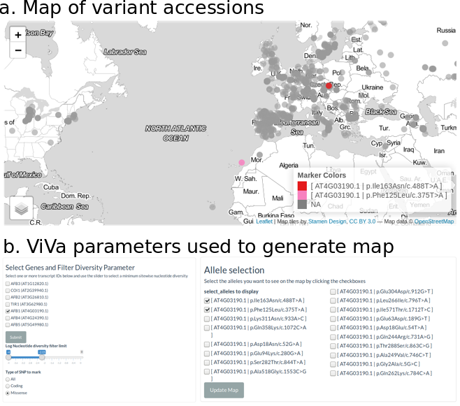

# Supplemental Analysis {#si}

## Additional natural variation in the *Aux/IAA* genes {#IAAs} 

For simplicity we have included only the alignment of the class A Aux/IAAs in the main manuscript. We include here the complete alignment of the family (Figure \@ref(fig:full-IAA-alignment)). 

```{r IAAdivstats}
gene_info <- geneInfoFromFile(
  fname = system.file("shiny-app", "gene_family_data",
                      "IAA_gene_ids.csv", package = "r1001genomes"))
#annotation <- readAnnotationFile(filename = system.file("shiny-app", "gene_family_data",
#                      "IAA_annotations.csv", package = "r1001genomes"), gene_info = gene_info)

VCF <- readRDS(system.file("shiny-app", "gene_family_data",
                      "IAAs_VCF.rds", package = "r1001genomes"))
div_stats <- ldply(VCF, diversityStats, geneInfo=gene_info, .id="transcript_ID")
div_stats$tair_symbol %<>% fct_reorder(.x = , div_stats$tair_symbol, 
                                       .fun = function(x) 
                                         {as.integer(str_remove(x, 
                                              pattern = "IAA"))})
div_stats %<>% arrange(tair_symbol)
div_stats %<>% dplyr::select(tair_symbol, everything())

```


```{r IAA alignment sup}
alignment <- alignCDS(gene_info$transcript_ID)
# make an alignment data frame
aln_df <- makeAlnDF(alignment[[2]])

# make a collapsed alignment for translating positions
collapsed_aln_df <- 
  aln_df %>% dplyr::select(aln_pos, seq_pos, seq_name) %>%
  tidyr::spread(key = seq_name, value = seq_pos)
```


```{r Mask_IAA_alignment_sup, eval=FALSE}
aliscore(as.AAbin(alignment[[2]]), path = "/Volumes/SSD/Applications/ALISCORE_v2.0/Aliscore_v.2.0/")
id <- scan(file = "input.fas_List_random.txt", sep = " ", quiet = TRUE)
AAAlign_no_gaps <- as.matrix(alignment[[2]])[, id]
write.nexus.data(AAAlign_no_gaps, file = "manuscript/IAAs.nex", format = "protein")
```
```{bash IAA_phylogeny_construction_sup, eval=FALSE}
~/Desktop/natural-variation-webtool/manuscript

/Applications/MrBayes/mb

execute IAAs.nex
# set IAA33 as the outgroup
outgroup AT5G57420.1

lset nucmodel=protein Rates=invgamma
# or include Nst=6  ngammacat=4 omegavar=M3 
prset aamodelpr=fixed(jones) statefreqpr=fixed(empirical) 
# initial run with aamodelpr=mixed yielded posterior prob of 1 for jones model
propset ExtTBR$prob=0

mcmcp ngen=250000 nchains=4 printfreq=1000 samplefreq=100 burnin=200

mcmc
sump
sumt

```

```{r Load IAA phylogeny and data_sup}
tree <- treeio::read.beast(file = "trees/IAAs.nex.con.tre")

IAA_data <- read.csv("tables/IAAs_table.csv")
#tip_labels need to be in the first column
IAA_data %<>% dplyr::select(name, everything())
IAA_data$name %<>% as.character()
IAA_data$AGI %<>% as.character()

IAA_data <- IAA_data[match(gsub(x = tree@phylo$tip.label, pattern = "\\.1",replacement = ""), IAA_data$AGI), ] 
tree@phylo$tip.label <- IAA_data$name
```


(ref:full-IAA-alignment) **Alignment of the complete Aux/IAA family.** Protein sequences were aligned with DECIPHER [@wright_decipher_2015] and variants were mapped to this alignment and colored according to the predicted functional effect of the allele of strongest effect at that position, with light colors having weaker effects on function and darker colors stronger effects. Red indicates missense variants. Color scale is further explained in [Methods](#methods). Alignment consensus is shown in grayscale underneath the plot as measured by Evolutionary trace [@pluciennik_balcony_2018; @wilkins_evolutionary_2012], with high consensus positions in black and low consensus in white.

```{r full-IAA-alignment, fig.cap="(ref:full-IAA-alignment)", fig.height=8}
IAAs <- alignCDS(gene_info$transcript_ID)
consensus <- BALCONY::RealValET_conservativity(as.alignment(Biostrings::as.matrix(IAAs[[2]])))
# make an alignment data frame
IAAs <- makeAlnDF(IAAs[[2]])
IAAs <- left_join(IAAs, dplyr::select(gene_info, "tair_locus",
                                       "tair_symbol", "transcript_ID"),
                        by = c("transcript_ID" = "transcript_ID"))
IAAs$tair_symbol %<>% as.factor()
IAAs$tair_symbol %<>% factor(levels = IAA_order, 
                                       ordered = TRUE)
IAAs$tair_symbol %<>% fct_rev()
VCF <- ldply(.data = VCF, .fun = subset, gt_GT != "0|0")
coding_VCF <- getCodingDiv(VCF)
IAAs <- addSNPsToAlnDF(aln_df = IAAs,SNPs = coding_VCF, effect_order = SNPeff_order)
IAAs$gap <- IAAs$seq_pos == "-"


p <-ggplot(IAAs, aes(x = aln_pos, y = tair_symbol)) +
  geom_raster(data = IAAs, 
             # mapping = aes(fill = effects)) +
              mapping = aes(fill = strength,
                            alpha = gap)) +
  scale_alpha_manual(values = c("TRUE" = 0, "FALSE" = 1), 
                     labels = c("aligned", "gap"), 
                     guide = guide_legend(override.aes = 
                                            list(fill = c("grey85", "white")),
                       title = "alignment",
                       direction = "vertical")) + 
   scale_fill_viridis(breaks = range(SNPeff_order$strength),
                      limits = range(SNPeff_order$strength),
                      na.value = "grey85",
                      direction = -1,
                      labels = c("weak", "strong"),
                      option = "A", 
                      guide = guide_colorbar(ticks = FALSE, 
                                             title.vjust = .8, 
                                             title.position = "top", 
                                             title.hjust = 0.5)) +
  scale_y_discrete(expand = expand_scale(add = c(1,2.5))) +
  scale_x_continuous(expand = c(0,0)) +  # expand increases distance from axis
  labs(x = "codon position in alignment", y = "", fill = "variant functional effect") +
  theme_logo(base_family = "Helvetica") +
  theme(panel.grid = element_blank(), 
        panel.grid.minor = element_blank(),
        strip.background = element_blank(),
        strip.text.x = element_blank(),
        #panel.background = element_rect(fill = "grey85", color = "white"),
        legend.position = c("bottom"),
        legend.key = element_rect(linetype = "solid"),
        legend.spacing = unit(4, "char"), 
        legend.box.spacing = unit(0.1,"line"))  +
  annotation_raster(matrix(gray(rescale(consensus, to = c(0,1))), nrow = 1),  xmin = -Inf, xmax = Inf, ymin = -10, ymax = 0.4)
p

#ggsave("IAAs.png", width = 7, height = 4)
```

```{r IAA6-div-plot, fig.cap="(ref:IAA6-div-plot)", fig.height=4}
coding_variants <- VCF[VCF$Transcript_ID == gene_info[gene_info$tair_symbol == "IAA6", "transcript_ID"], ]
p <- plotCodingDiv(uniqueCodingVars = coding_variants)
p + annotate("rect", xmin = 106, xmax = 127, ymin = 0.001, ymax = 1, 
             color = "lightgrey", alpha =.1) + 
  annotate("text", x = 116.5, y = 0.1, 
           label = 
             "region of positive selection\nidentified in Winkler et al.") + labs(color = "", y = "nucleotide diversity,\nlog scale") + theme(legend.position = "bottom", legend.text = element_text(size = 8), axis.title = element_text(size = 12)) + guides(color=guide_legend(nrow=5))
```
(ref:IAA6-div-plot) **IAA6 diversity plot.** Nucleotide diversity of variant positions throughout the IAA6 coding sequence are plotted and colored according to the effect of the variant alleles at each position. The region of positive selection identified by Winkler et al. is highlighted.


## Natural variation in the *TIR1/AFB* genes {#AFBs} 
Auxin acts by binding to receptors (Auxin-signaling F-Boxes, or AFBs) that in turn target co-repressors (Aux/IAAs) for degradation. The six auxin receptor genes in the model plant *Arabidopsis thaliana*, *TIR1* and *AFB1-5*, evolved through gene duplication and diversification early in the history of vascular plants [@parry_complex_2009]. The rate of co-repressor degradation is determined by the identity of both the receptor and co-repressor [@havens_synthetic_2012], and this rate sets the pace of lateral root development [@guseman_auxininduced_2015]. 

All members of this family have been shown to bind auxin and Aux/IAA proteins. However, AFB1 has a drastically reduced ability to assemble into an SCF complex, due to the substitution E8K in its F-box domain, preventing it from inducing degradation of Aux/IAAs [@yu_untethering_2015]. This lack of SCF formation may allow for the high and ubiquitous AFB1 accumulation observed in *Arabidopsis* tissues [@parry_complex_2009]. Higher order receptor mutants in the family containing *afb1* mutants suggest that *AFB1* has a moderate positive effect on auxin signaling [@dharmasiri_plant_2005]. Additionally, AFB4 and AFB5 have been shown to preferentially and functionally bind the synthetic auxin picloram, while other family members preferentially bind indole-3-acetic acid [@prigge_arabidopsis_2016]. Interestingly, the strength and rate with which TIR1/AFBs are able to bind and mark Aux/IAAs for degradation are variable [@calderonvillalobos_combinatorial_2012; @havens_synthetic_2012]. AFB2 induces the degradation of certain Aux/IAA proteins at a faster rate than TIR1, suggesting some functional specificity has arisen since the initial duplication between the *TIR1/AFB1* and *AFB2/AFB3* clades.

```{r TIR1AFBdivstats}
gene_info <- geneInfoFromFile(
  fname = system.file("shiny-app", "gene_family_data",
                      "AFB_gene_ids.csv", package = "r1001genomes"))

VCF <- readRDS(system.file("shiny-app", "gene_family_data",
                      "AFBs_VCF.rds", package = "r1001genomes"))
div_stats <- ldply(VCF, diversityStats, geneInfo=gene_info, .id="transcript_ID")
div_stats$tair_symbol %<>% fct_reorder(.x =  div_stats$tair_symbol, 
                                       .fun = function(x) 
                                         {as.integer(str_remove(x, 
                                              pattern = "AFB|TIR"))})
div_stats$tair_symbol %<>% fct_relevel("TIR1")
div_stats %<>% arrange(tair_symbol)
div_stats %<>% dplyr::select(tair_symbol, everything())

```

```{r AFB_ alignment}
alignment <- alignCDS(gene_info$transcript_ID)
consensus <- BALCONY::RealValET_conservativity(as.alignment(Biostrings::as.matrix(alignment[[2]])))
# make an alignment data frame
aln_df <- makeAlnDF(alignment[[2]])

# make a collapsed alignment for translating positions
collapsed_aln_df <- 
  aln_df %>% dplyr::select(aln_pos, seq_pos, seq_name) %>%
  tidyr::spread(key = seq_name, value = seq_pos)
```

```{r Mask_AFB_alignment, eval=FALSE}
aliscore(as.AAbin(alignment[[2]]), path = "/Volumes/SSD/Applications/ALISCORE_v2.0/Aliscore_v.2.0/",  o = "AT2G39940")
id <- scan(file = "/Volumes/SSD/Applications/ALISCORE_v2.0/Aliscore_v.2.0/input.fas_List_random.txt", sep = " ", quiet = TRUE)
AAAlign_no_gaps <- as.matrix(alignment[[2]])[, id]
write.nexus.data(AAAlign_no_gaps, file = "trees/AFBs.nex", format = "protein")
```
```{bash AFB_phylogeny_construction, eval=FALSE}
cd ~/Desktop/natural-variation-webtool/manuscript/trees

/Applications/MrBayes/mb

execute AFBs.nex
# set IAA33 as the outgroup
outgroup AT2G39940.1

lset nucmodel=protein Rates=invgamma
# or include Nst=6  ngammacat=4 omegavar=M3 
prset aamodelpr=fixed(jones) statefreqpr=fixed(empirical) 
# initial run with aamodelpr=mixed yielded posterior prob of 1 for jones model
propset ExtTBR$prob=0

mcmcp ngen=250000 nchains=4 printfreq=1000 samplefreq=100 burnin=200

mcmc
sump
sumt

```

```{r Load AFB phylogeny and data}
tree <- treeio::read.beast(file = "trees/AFBs.nex.con.tre")

AFB_data <- read.csv(system.file("shiny-app", "gene_family_data",
                      "AFB_gene_ids.csv", package = "r1001genomes"))
AFB_data %<>% left_join(y = div_stats, by = c("name" = "tair_symbol"))
#tip_labels need to be in the first column
AFB_data %<>% dplyr::select(name, everything())
AFB_data$tair_locus %<>% as.character()

AFB_data <- AFB_data[match(gsub(x = tree@phylo$tip.label, pattern = "\\.1",replacement = ""), AFB_data$tair_locus), ] 

tree@phylo$tip.label <- AFB_data$name
```


```{r AFBtree, fig.cap="(ref:AFBtree)"}
p <- ggtree(tree, layout = "rectangular", color = "grey") %<+% AFB_data + theme_tree() + scale_x_continuous(expand = c(0, 1.2)) + 
  geom_tippoint(mapping = aes(size = 4*Pi_NS_Ratio, fill = Pi_NS_Ratio), shape = 21, color = "white", show.legend = TRUE) + 
  scale_fill_viridis(values = rescale(c(min(AFB_data$Pi_NS_Ratio),
                                        max(AFB_data$Pi_NS_Ratio)), 
                                      to = c(0,1)), guide = "colourbar", 
                     breaks = round(c(min(AFB_data$Pi_NS_Ratio),
                                        max(AFB_data$Pi_NS_Ratio), 1)
                                    ,2), 
                     labels = round(c(min(AFB_data$Pi_NS_Ratio),
                                        max(AFB_data$Pi_NS_Ratio), 1),
                                    2))+
  scale_size(guide = "none") +
  labs(fill = expression(pi [N] / pi [S])) + 
  theme(legend.position = c(.1,.5)) + 
  #geom_nodelab(mapping = aes(label = node)) +
  geom_nodelab(mapping = aes(label = round(as.numeric(prob),digits = 2)), nudge_x = -.2, nudge_y = .2, size = 3) + 
  geom_tiplab(hjust = -0.25) + 
  scale_color_viridis(discrete = TRUE)  
p <- p %>% ggtree::rotate(12) %>% ggtree::rotate(9)
p
#ggsave("AFBs_tree.pdf", height = 3, width = 4)
```
(ref:AFBtree) **AFB protein sequence tree mapped with ${\pi_N/\pi_S}$.** Protein sequences were aligned with DECIPHER [@wright_decipher_2015] and low information content regions were masked with Aliscore [@kuck_parametric_2010] prior to inferring a phylogeny with MrBayes [@ronquist_mrbayes_2003]. Tips of the tree are mapped with circles of diameter proportional to ${\pi_N/\pi_S}$ and also are colored according to ${\pi_N/\pi_S}$. Nodes are labeled with the posterior probability of monophyly.

Examining the natural sequence variation across the *AFB* family revealed that *TIR1* and *AFB1* both had very low nonsynonymous diversity (Figure \@ref(fig:AFBtree)), hinting at their likely functional importance and bringing in to question the inconclusive role of *AFB1* in auxin signaling. *AFB3* and *AFB4* had higher nonsynonymous diversity, while their sister genes, *AFB2* and *AFB5* were more conserved. This matches our current understanding of *AFB3* as playing a minor role in the auxin signaling pathway [@dharmasiri_plant_2005]. Two frameshift variants and one stop-gained (nonsense) variant were observed in *AFB4* supporting its pseudogenization., suggesting that *AFB4* may be undergoing pseudogenization, especially when paired with its low expression levels [@prigge_arabidopsis_2016]. AFB4 and AFB5 have an N-terminal extension prior to their F-box domains. This extension had very high nonsynonymous diversity (Figure \@ref(fig:full-AFBs-alignment)), suggesting that this extension does not play an important functional role in these proteins. 

```{r full-AFBs-alignment, fig.cap="(ref:full-AFBs-alignment)"}
AFB_order <- fct_inorder(na.exclude(p$data$label[base::order(p$data$y, decreasing = TRUE)]), ordered = TRUE)

aln_df <- left_join(aln_df, dplyr::select(gene_info, "tair_locus",
                                       "tair_symbol", "transcript_ID"),
                        by = c("transcript_ID" = "transcript_ID"))
aln_df$tair_symbol %<>% factor(levels = AFB_order, 
                                       ordered = TRUE)
aln_df$tair_symbol %<>% fct_rev()
VCF <- ldply(.data = VCF, .fun = subset, gt_GT != "0|0")
VCF <- getCodingDiv(VCF)

aln_df <- addSNPsToAlnDF(aln_df, VCF, effect_order = SNPeff_order)
aln_df$gap <- aln_df$seq_pos == "-"

p <-ggplot(aln_df, aes(x = aln_pos, y = tair_symbol)) +
  geom_raster(mapping = aes(fill = strength,
                            alpha = gap)) +
  scale_alpha_manual(values = c("TRUE" = 0, "FALSE" = 1), 
                     labels = c("aligned", "gap"), 
                     guide = guide_legend(override.aes = 
                                            list(fill = c("grey85", "white")),
                       title = "alignment",
                       direction = "vertical")) + 
   scale_fill_viridis(breaks = range(SNPeff_order$strength),
                      limits = range(SNPeff_order$strength),
                      na.value = "grey85",
                      direction = -1,
                      labels = c("weak", "strong"),
                      option = "A", 
                      guide = guide_colorbar(ticks = FALSE, 
                                             title.vjust = .8, 
                                             title.position = "top", 
                                             title.hjust = 0.5)) +
  scale_y_discrete(expand = expand_scale(add = c(1,2.5))) +
  scale_x_continuous(expand = c(0,0)) +  # expand increases distance from axis
  labs(x = "codon position in alignment", y = "", fill = "variant functional effect") +
  theme_logo(base_family = "Helvetica") +
  theme(panel.grid = element_blank(), 
        panel.grid.minor = element_blank(),
        strip.background = element_blank(),
        strip.text.x = element_blank(),
        #panel.background = element_rect(fill = "grey85", color = "white"),
        legend.position = c("bottom"),
        legend.key = element_rect(linetype = "solid"),
        legend.spacing = unit(4, "char"), 
        legend.box.spacing = unit(0.1,"line"))  +
  annotation_raster(matrix(gray(rescale(consensus, to = c(0,1))), nrow = 1),  xmin = -Inf, xmax = Inf, ymin = -10, ymax = 0.4)
p


```

(ref:full-AFBs-alignment) **Alignment of the AFB family** Protein sequences were aligned with DECIPHER [@wright_decipher_2015] and variants were mapped to this alignment and colored according to the predicted functional effect of the allele of strongest effect at that position, with light colors having weaker effects on function and darker colors stronger effects. Red indicates missense variants. Color scale is explained in [Methods](#methods). In grayscale underneath the plot, alignment consensus is shown as measured by Evolutionary trace [@pluciennik_balcony_2018; @wilkins_evolutionary_2012], with high consensus positions in black and low consensus in white.

Although most known functional regions are highly conserved in *AFB1*, there are some nonsynonymous polymorphism in the oligomerization domain that are only present in single accessions (F125E in Can-0 and I163N in Pu2-23, as shown in Figure \@ref(fig:AFB1-map)). Mutations in this domain of *TIR1* frequently have a semidominant effect on root phenotypes [@dezfulian_oligomerization_2016; @wright_insights_2017]. Characterization of this allele and accession may help determine the role of *AFB1* in this pathway.

```{r AFB1-map, fig.cap="(ref:AFB1-map)"}

```

(ref:AFB1-map) **Map of AFB1 Oligomerization domain variant accessions.** (a) Map showing the two accessions with variants in the AFB1 oligomerization domain (b) The user selectable parameters of the mapping tab used to generate the map are provided as an example of using the SNP Mapping tab in the ViVa webtool. See Figure \@ref(fig:app-workflow) for details on filling in the parameters.

## Natural variation in the *TPL/TPR* genes {#TPLs}

The auxin signaling pathway utilizes the TOPLESS (TPL) and TOPLESS-related (TPR) family of Gro/TLE/TUP1 type co-repressor proteins to maintain auxin responsive genes in a transcriptionally-repressed state in the absence of auxin [@szemenyei_topless_2008]. In *Arabidopsis thaliana* the five member *TPL/TPR* family includes *TPL* and *TPR1-4*. The resulting proteins are comprised of three structural domains: an N-terminal TPL domain and two WD-40 domains [@long_topless_2006]. TPL/TPR proteins are recruited to the AUX/IAA proteins through interaction with the conserved Ethylene-responsive element binding factor-associated amphiphilic repression (EAR) domain [@szemenyei_topless_2008]. Canonical EAR domains have the amino acid sequence LxLxL, as found in most AUX/IAAs [@overvoorde_functional_2005]. TPL/TPR co-repressors bind EAR domains via their C-terminal to LisH (CTLH) domains found near their N-termini [@long_topless_2006]. Recent structural analyses of the TPL N-terminal domain have highlighted the precise interaction interface between TPL and AUX/IAA EAR domains, as well as the TPL-TPL dimerization and tetramerization motifs [@martin-arevalillo_structure_2017; @ke_structural_2015]. The residues required for higher-order multimers of TPL tetramers have also been identified [@ma_d53_2017]. Additional interactions with transcriptional regulation and chromatin modifying machinery are likely mediated by two tandem beta propeller domains of TPL/TPRs.
  
The TOPLESS co-repressor family generally exhibits a high level of sequence conservation at the amino acid sequence level across resequenced *Arabidopsis thaliana* accessions, with all ${\pi_N/\pi_S}$ values below 1 (Figure \@ref(fig:TPLtree)). The closely related *TPL* and *TPR1* have the highest ${\pi_N/\pi_S}$ values, suggesting that these these two related genes tolerate a higher degree of sequence and potentially functional diversity compared to *TPR2/3/4*. The N-terminal TPL domain of the TPL/TPR family is particularly conserved. All nonsynonymous polymorphisms observed in this region are either in the coils between helices or are highly conservative mutations within helices (i.e. valine to isoleucine), which would be predicted to exhibit little effect on folding and function. 

```{r TPL-SNPstats}
gene_info <- geneInfoFromFile(
  fname = system.file("shiny-app", "gene_family_data",
                      "TPL_gene_ids.csv", package = "r1001genomes"))
#annotation <- readAnnotationFile(filename = system.file("shiny-app", "gene_family_data",
#                      "TPL_annotations.csv", package = "r1001genomes"), gene_info = gene_info)

VCF <- readRDS(system.file("shiny-app", "gene_family_data",
                      "TPL_VCF.rds", package = "r1001genomes"))
div_stats <- ldply(VCF, diversityStats, geneInfo=gene_info, .id="transcript_ID")
div_stats$tair_symbol %<>% fct_reorder(.x = , div_stats$tair_symbol, 
                                       .fun = function(x) 
                                         {as.integer(str_remove(x, 
                                              pattern = "TPR"))})
div_stats$tair_symbol %<>% fct_relevel("TPL")
div_stats %<>% arrange(tair_symbol)
div_stats %<>% dplyr::select(tair_symbol, everything())
```

```{r TPL-alignment-coding-vars}
alignment <- alignCDS(gene_info$transcript_ID)
consensus <- BALCONY::RealValET_conservativity(as.alignment(Biostrings::as.matrix(alignment[[2]])))
#possible outgroups  AtLUG, At4g32551; AtLUH, At2g32700
# make an alignment data frame
aln_df <- makeAlnDF(alignment[[2]])

#get
VCF <- ldply(.data = VCF, .fun = subset, gt_GT != "0|0")
VCF <- getCodingDiv(VCF)

# make a collapsed alignment for translating positions
collapsed_aln_df <- 
  aln_df %>% dplyr::select(aln_pos, seq_pos, seq_name) %>%
  tidyr::spread(key = seq_name, value = seq_pos)
```


```{r Mask_TPL_alignment, eval=FALSE}
aliscore(as.AAbin(alignment[[2]]), path = "/Volumes/SSD/Applications/ALISCORE_v2.0/Aliscore_v.2.0/")
id <- scan(file = "/Volumes/SSD/Applications/ALISCORE_v2.0/Aliscore_v.2.0/input.fas_List_random.txt", sep = " ", quiet = TRUE)
AAAlign_no_gaps <- as.matrix(alignment[[2]])[, id]
write.nexus.data(AAAlign_no_gaps, file = "TPLs.nex", format = "protein")
```
```{bash TPL_phylogeny_construction, eval=FALSE}
/Applications/MrBayes/mb

execute TPLs.nex
# set ARF17 as the outgroup
outgroup AT1G77850.1

lset nucmodel=protein Rates=invgamma
# or include Nst=6  ngammacat=4 omegavar=M3 
prset aamodelpr=fixed(jones) statefreqpr=fixed(empirical) 
# initial run with aamodelpr=mixed yielded posterior prob of 1 for jones model
propset ExtTBR$prob=0

mcmcp ngen=250000 nchains=4 printfreq=1000 samplefreq=100 burnin=200

mcmc
sump
sumt

```
```{r Load TPL phylogeny and data}
tree <- treeio::read.beast(file = "trees/TPLs.nex.con.tre")


TPL_data <- read.csv(system.file("shiny-app", "gene_family_data",
                      "TPL_gene_ids.csv", package = "r1001genomes"))
TPL_data$name <- as.character(TPL_data$name)
TPL_data %<>% left_join(y = div_stats, by = c("name" = "tair_symbol"))
#tip_labels need to be in the first column
TPL_data %<>% dplyr::select(name, everything())
TPL_data$tair_locus %<>% as.character()

TPL_data <- TPL_data[match(gsub(x = tree@phylo$tip.label, pattern = "\\.1",replacement = ""), TPL_data$tair_locus), ] 

tree@phylo$tip.label <- TPL_data$name

```

```{r TPLtree, fig.cap="(ref:TPLtree)"}
p <- ggtree(tree, layout = "rectangular", color = "grey") %<+% TPL_data + theme_tree() + scale_x_continuous(expand = c(0, 1.2)) + 
  geom_tippoint(mapping = aes(size = 4*Pi_NS_Ratio, fill = Pi_NS_Ratio), shape = 21, color = "white", show.legend = TRUE) + 
  scale_fill_viridis(values = rescale(c(min(TPL_data$Pi_NS_Ratio),
                                        max(TPL_data$Pi_NS_Ratio),1), 
                                      to = c(0,1)), guide = "colourbar", 
                     breaks = c(min(TPL_data$Pi_NS_Ratio),
                                        max(TPL_data$Pi_NS_Ratio), 1), 
                     labels = round(c(min(TPL_data$Pi_NS_Ratio),
                                        max(TPL_data$Pi_NS_Ratio), 1),
                                    2)) + scale_size(guide = "none") +
  labs(fill = expression(pi [N] / pi [S])) + 
  theme(legend.position = c(.1,.5)) + 
  #geom_nodelab(mapping = aes(label = node)) +
  geom_nodelab(mapping = aes(label = round(as.numeric(prob),digits = 2)), nudge_x = -.2, nudge_y = .2, size = 3) + 
  geom_tiplab(hjust = -0.25) 
p
```

(ref:TPLtree) **TPL protein sequence tree mapped with ${\pi_N/\pi_S}$.** Protein sequences were aligned with DECIPHER [@wright_decipher_2015] and low information content regions were masked with Aliscore [@kuck_parametric_2010] prior to inferring a phylogeny with MrBayes [@ronquist_mrbayes_2003]. Tips of the tree are mapped with circles of diameter proportional to ${\pi_N/\pi_S}$ and also are colored according to ${\pi_N/\pi_S}$. Nodes are labeled with the poster probability of monophyly.
  
The high degree of conservation in the entire N-terminal domain underscores its importance in TPL/TPR function (Figure \@ref(fig:full-TPLs-alignment)). For example, the initial *tpl-1* mutation (N176H) in the ninth helix is a dominant gain-of-function allele [@long_topless_2006], which is capable of binding wild-type TPL protein and inducing protein aggregation [@ma_d53_2017]. It is therefore understandable that this helix had very low diversity as nonsynonymous variants in this domain could act in a dominant negative fashion. 

(ref:full-TPLs-alignment) **Alignment of the TPL/TPR family.** Protein sequences were aligned with DECIPHER [@wright_decipher_2015] and variants were mapped to this alignment and colored according to the predicted functional effect of the allele of strongest effect at that position, with light colors having weaker effects on function and darker colors stronger effects. Red indicates missense variants. Color scale is explained in [Methods](#methods). In grayscale underneath the plot, alignment consensus is shown as measured by Evolutionary trace [@pluciennik_balcony_2018; @wilkins_evolutionary_2012], with high consensus positions in black and low consensus in white.
```{r full-TPLs-alignment, fig.cap= "(ref:full-TPLs-alignment)"}
TPL_order <- fct_inorder(na.exclude(p$data$label[base::order(p$data$y, decreasing = TRUE)]), ordered = TRUE)

aln_df <- left_join(aln_df, dplyr::select(gene_info, "tair_locus",
                                       "tair_symbol", "transcript_ID"),
                        by = c("transcript_ID" = "transcript_ID"))
aln_df$tair_symbol %<>% factor(levels = TPL_order, 
                                       ordered = TRUE)
aln_df$tair_symbol %<>% fct_rev()

aln_df <- addSNPsToAlnDF(aln_df, VCF, effect_order = SNPeff_order)
aln_df$gap <- aln_df$seq_pos == "-"

p <-ggplot(aln_df, aes(x = aln_pos, y = tair_symbol)) +
  geom_raster(data = aln_df, 
             # mapping = aes(fill = effects)) +
              mapping = aes(fill = strength,
                            alpha = gap)) +
  scale_alpha_manual(values = c("TRUE" = 0, "FALSE" = 1), 
                     labels = c("aligned", "gap"), 
                     guide = guide_legend(override.aes = 
                                            list(fill = c("grey85", "white")),
                       title = "alignment",
                       direction = "vertical")) + 
   scale_fill_viridis(breaks = range(SNPeff_order$strength),
                      limits = range(SNPeff_order$strength),
                      na.value = "grey85",
                      direction = -1,
                      labels = c("weak", "strong"),
                      option = "A", 
                      guide = guide_colorbar(ticks = FALSE, 
                                             title.vjust = .8, 
                                             title.position = "top", 
                                             title.hjust = 0.5)) +
  scale_y_discrete(expand = expand_scale(add = c(1,2.5))) +
  scale_x_continuous(expand = c(0,0)) +  # expand increases distance from axis
  labs(x = "codon position in alignment", y = "", fill = "variant functional effect") +
  theme_logo(base_family = "Helvetica") +
  theme(panel.grid = element_blank(), 
        panel.grid.minor = element_blank(),
        strip.background = element_blank(),
        strip.text.x = element_blank(),
        #panel.background = element_rect(fill = "grey85", color = "white"),
        legend.position = c("bottom"),
        legend.key = element_rect(linetype = "solid"),
        legend.spacing = unit(4, "char"), 
        legend.box.spacing = unit(0.1,"line")) +
  annotation_raster(matrix(gray(rescale(consensus, to = c(0,1))), nrow = 1),  xmin = -Inf, xmax = Inf, ymin = -10, ymax = 0.4)
p

```

## Natural Variation in the *ARF* genes {#ARFs} 

Auxin response is mediated by the auxin responsive transcription factors (ARFs). There are 23 *ARF*s in *Arabidopsis thaliana* that are divided into three phylogenetic classes. Class A ARFs (ARF5, ARF6, ARF7, ARF8 and ARF19) activate transcription. These ARFs have a glutamine-rich region in the middle of the protein that may mediate activation [@guilfoyle_auxin_2007]. It has recently been shown that the middle region of ARF5 interacts with the SWI/SNF chromatin remodeling ATPases BRAMA and SPLAYED, possibly to reduce nucleosome occupancy and allow for the recruitment of transcription machinery [@wu_auxinregulated_2015]. Additionally, ARF7 interacts with Mediator subunits, directly tethering transcriptional activation machinery to its binding sites in the chromosome [@ito_auxindependent_2016]. Class B and C *ARF*s are historically categorized as repressor *ARF*s, though the mechanism through which they confer repression has not been identified. Their middle regions tend to be proline- and serine-rich. 

Canonical ARFs are comprised of three major domains. Recent crystallization of these domains have informed structure-function analysis of the ARFs [@boer_structural_2014; @korasick_molecular_2014; @nanao_structural_2014]. These domains are conserved throughout land plants [@mutte_origin_2018]. ARFs share an N-terminal B3 DNA binding domain. Flanking this DNA-binding domain is a dimerization domain, which folds up into a single “taco-shaped” domain to allow for dimerization between ARFs. There is an auxiliary domain that immediately follows and interacts with the dimerization domain. The middle region is the most variable between ARFs, as mentioned above, but is characterized by repetitive units of glutamine (class A), serine, or proline residues (classes B and C). The C-terminal domain of canonical ARFs is a PB1 protein-protein interaction domain mediating interactions among ARFs, between ARFs and other transcription factors, and between ARFs and the Aux/IAA repressors. This interaction domain was recently characterized as a Phox and Bem1 (PB1) domain, which is comprised of a positive and negative face with conserved basic and acidic residues, respectively [@korasick_molecular_2014; @nanao_structural_2014]. The dipolar nature of the PB1 domain may mediate multimerization by the pairwise interaction of these faces on different proteins as the ARF7 PB1 domain was crystallized as a multimer [@korasick_molecular_2014]. However, it is unclear whether ARF multimerization occurs or plays a significant role *in vivo*. Interfering with ARF dimerization in either the DNA-binding proximal dimerization domain or the PB1 domain decreases the ability of class A ARFs to activate transcription in a heterologous yeast system [@pierre-jerome_functional_2016]. 

While domain architecture is broadly conserved among the ARFs, there are exceptional cases. Three ARFs do not contain a PB1 domain at all, ARF3, ARF13, and ARF17, and several more have lost the conserved acidic or basic residues in the PB1 domain, suggesting they may be reduced to a single interaction domain. Several ARFs additionally have an expanded conserved region within the DNA-binding domain, of unknown function. The majority of domain variation among ARFs occurs in the large B-class subfamily. The liverwort *Marchantia polymorpha* has a single representative ARF of each class [@flores-sandoval_simple_2015]. The expansion of these classes in flowering plants is the result of both whole genome and tandem duplication events [@remington_contrasting_2004]. The growth of the ARF family may have allowed for the expansion of the quantity and complexity of loci regulated by the ARFs and subsequent expansion in their regulation of developmental processes [@mutte_origin_2018].  

Class A ARFs are the most well-studied ARF subfamily---the five family members all act as transcriptional activators and have well-characterized, distinct developmental targets. Overall the diversity of class A *ARF*s was generally low, especially compared to the class B and C *ARF*s (Figure \@ref(fig:ARFtree)), suggesting that class A *ARF*s are central to auxin signal transduction and plant development. Analysis of class A *ARF* nonsynonymous diversity suggests that the majority of these *ARF*s are highly functionally conserved, with ${\pi_N/\pi_S}$ values much lower than 1 with the exception of *ARF19*, with ${\pi_N/\pi_S}$ value of 1.8. Comparing diversity within sister pairs, there is a similar trade-off as seen in most *IAA* sister pairs, with one sister being highly conserved and the other more divergent. *ARF19* and *ARF8* are the more divergent class A *ARFs*, with ${\pi_N/\pi_S}$ values at least three time those of their sisters, *ARF7* and *ARF6* respectively. This may suggest that ARF6 and ARF7 serve more essential purposes in plant development. 

```{r ARF diversity stats}
gene_info <- geneInfoFromFile(
  fname = system.file("shiny-app", "gene_family_data",
                      "ARF_gene_ids.csv", package = "r1001genomes"))
annotation <- readAnnotationFile(filename = system.file("shiny-app", 
  "gene_family_data", "ARF_annotations.csv", 
  package = "r1001genomes"), gene_info = gene_info)

VCF <- readRDS(system.file("shiny-app", "gene_family_data",
                      "ARF_VCF.rds", package = "r1001genomes"))
div_stats <- ldply(VCF, diversityStats, geneInfo=gene_info, .id="transcript_ID")
div_stats$tair_symbol %<>% fct_reorder(.x =  div_stats$tair_symbol, 
                                       .fun = function(x) 
                                         {as.integer(str_remove(x, 
                                              pattern = "ARF"))})
div_stats %<>% arrange(tair_symbol)
div_stats %<>% dplyr::select(tair_symbol, everything())

```

```{r ARF-alignment-coding-vars}
alignment <- alignCDS(gene_info$transcript_ID)
consensus <- BALCONY::RealValET_conservativity(as.alignment(Biostrings::as.matrix(alignment[[2]])))
# make an alignment data frame
aln_df <- makeAlnDF(alignment[[2]])

#get
VCF <- ldply(.data = VCF, .fun = subset, gt_GT != "0|0")
VCF <- getCodingDiv(VCF)

# make a collapsed alignment for translating positions
collapsed_aln_df <- 
  aln_df %>% dplyr::select(aln_pos, seq_pos, seq_name) %>%
  tidyr::spread(key = seq_name, value = seq_pos)
```

```{r Mask_ARF_alignment, eval=FALSE}
aliscore(as.AAbin(alignment[[2]]), path = "/Volumes/SSD/Applications/ALISCORE_v2.0/Aliscore_v.2.0/")
id <- scan(file = "/Volumes/SSD/Applications/ALISCORE_v2.0/Aliscore_v.2.0/input.fas_List_random.txt", sep = " ", quiet = TRUE)
AAAlign_no_gaps <- as.matrix(alignment[[2]])[, id]
write.nexus.data(AAAlign_no_gaps, file = "ARFs.nex", format = "protein")
```
```{bash ARF_phylogeny_construction, eval=FALSE}
/Applications/MrBayes/mb

execute ARFs.nex
# set ARF17 as the outgroup
outgroup AT1G77850.1

lset nucmodel=protein Rates=invgamma
# or include Nst=6  ngammacat=4 omegavar=M3 
prset aamodelpr=fixed(jones) statefreqpr=fixed(empirical) 
# initial run with aamodelpr=mixed yielded posterior prob of 1 for jones model
propset ExtTBR$prob=0

mcmcp ngen=250000 nchains=4 printfreq=1000 samplefreq=100 burnin=200

mcmc
sump
sumt

```

```{r Load ARF phylogeny and data}
tree <- treeio::read.beast(file = "trees/ARFs.nex.con.tre")


ARF_data <- read.csv(system.file("shiny-app", "gene_family_data",
                      "ARF_gene_ids.csv", package = "r1001genomes"))
ARF_data %<>% left_join(y = div_stats, by = c("name" = "tair_symbol"))
#tip_labels need to be in the first column
ARF_data %<>% dplyr::select(name, everything())
ARF_data$tair_locus %<>% as.character()

ARF_data <- ARF_data[match(gsub(x = tree@phylo$tip.label, pattern = "\\.1",replacement = ""), ARF_data$tair_locus), ] 

tree@phylo$tip.label <- ARF_data$name

```

```{r ARFtree, fig.cap="(ref:ARFtree)"}
p <- ggtree(tree, layout = "rectangular", color = "grey") %<+% 
  ARF_data + theme_tree() + scale_x_continuous(expand = c(0, 1.2)) +
  geom_tippoint(mapping = 
                  aes(size = 4*Pi_NS_Ratio, fill = Pi_NS_Ratio),
                shape = 21, show.legend = TRUE, color = "white",
                position = position_nudge(x = 0.1)) + 
  geom_rootpoint(color = "grey") + 
  geom_nodelab(mapping = aes(label = round(as.numeric(prob), 
                                           digits = 2)), 
               nudge_x = -.3, nudge_y = .5, size = 3) +
  scale_fill_viridis(values = rescale(c(min(ARF_data$Pi_NS_Ratio), 1,
                                        max(ARF_data$Pi_NS_Ratio)), 
                                      to = c(0,1)), guide = "colourbar",
                     breaks = c(min(ARF_data$Pi_NS_Ratio), 1,
                                        max(ARF_data$Pi_NS_Ratio)), 
                     labels = round(c(min(ARF_data$Pi_NS_Ratio), 1,
                                        max(ARF_data$Pi_NS_Ratio)), 2)) +
  scale_size(guide = "none") + 
  theme(legend.position = c(.1,.4)) + 
  geom_tiplab(mapping = aes(color = class), hjust = -0.4) + 
  scale_color_viridis(end = .9, discrete = TRUE, option = "A") + 
  labs(fill = expression(pi [N] / pi [S]), color = "ARF class")
p %<>% ggtree::flip(28,32) %>% ggtree::rotate(35)
p 
```

(ref:ARFtree) **ARF protein sequence tree mapped with ${\pi_N/\pi_S}$.** Protein sequences were aligned with DECIPHER [@wright_decipher_2015] and low information content regions were masked with Aliscore [@kuck_parametric_2010] prior to inferring a phylogeny with MrBayes [@ronquist_mrbayes_2003]. Tips of the tree are mapped with circles of diameter proportional to ${\pi_N/\pi_S}$ and also are colored according to ${\pi_N/\pi_S}$. Nodes are labeled with the poster probability of monophyly.

For all class A *ARF*s, the middle region of the protein was the predominant high diversity region (Figure \@ref(fig:full-ARFs-alignment)). In the analyzed natural variation, ARF7 had several expansions of polyglutamine sequences in the middle region. Polyglutamine regions are known to readily expand and contract throughout evolutionary time due to replication error, and variation in polyglutamine length can have phenotypic consequences and be acted on by natural selection [@press_overdue_2014]. The ARF DNA-binding domain had very few, low-diversity missense mutations, as did the critical residues of the PB1 domain. Considering the necessity of their conserved functions, the low level of variation in these key DNA and protein-protein interaction domains is expected. 

```{r full-ARFs-alignment, fig.cap="(ref:full-ARFs-alignment)", fig.height=8}
ARF_order <- fct_inorder(na.exclude(p$data$label[base::order(p$data$y, decreasing = TRUE)]), ordered = TRUE)

aln_df <- left_join(aln_df, dplyr::select(gene_info, "tair_locus",
                                       "tair_symbol", "transcript_ID"),
                        by = c("transcript_ID" = "transcript_ID"))
aln_df$tair_symbol %<>% factor(levels = ARF_order, 
                                       ordered = TRUE)
aln_df$tair_symbol %<>% fct_rev()

aln_df <- addSNPsToAlnDF(aln_df, VCF)
aln_df$gap <- aln_df$seq_pos == "-"

p <-ggplot(aln_df, aes(x = aln_pos, y = tair_symbol)) +
  geom_raster(data = aln_df, 
             # mapping = aes(fill = effects)) +
              mapping = aes(fill = strength,
                            alpha = gap)) +
  scale_alpha_manual(values = c("TRUE" = 0, "FALSE" = 1), 
                     labels = c("aligned", "gap"), 
                     guide = guide_legend(override.aes = 
                                            list(fill = c("grey85", "white")),
                       title = "alignment",
                       direction = "vertical")) + 
   scale_fill_viridis(breaks = range(SNPeff_order$strength),
                      limits = range(SNPeff_order$strength),
                      na.value = "grey85",
                      direction = -1,
                      labels = c("weak", "strong"),
                      option = "A", 
                      guide = guide_colorbar(ticks = FALSE, 
                                             title.vjust = .8, 
                                             title.position = "top", 
                                             title.hjust = 0.5)) +
  scale_y_discrete(expand = expand_scale(add = c(1,2.5))) +
  scale_x_continuous(expand = c(0,0)) +  # expand increases distance from axis
  labs(x = "codon position in alignment", y = "", fill = "variant functional effect") +
  theme_logo(base_family = "Helvetica") +
  theme(panel.grid = element_blank(), 
        panel.grid.minor = element_blank(),
        strip.background = element_blank(),
        strip.text.x = element_blank(),
        #panel.background = element_rect(fill = "grey85", color = "white"),
        legend.position = c("bottom"),
        legend.key = element_rect(linetype = "solid"),
        legend.spacing = unit(4, "char"), 
        legend.box.spacing = unit(0.1,"line")) +
  annotation_raster(matrix(gray(rescale(consensus, to = c(0,1))), nrow = 1),  xmin = -Inf, xmax = Inf, ymin = -10, ymax = 0.4)
p

```

(ref:full-ARFs-alignment) **Alignment of the full ARF family.** Protein sequences were aligned with DECIPHER [@wright_decipher_2015] and variants were mapped to this alignment and colored according to the predicted functional effect of the allele of strongest effect at that position, with light colors having weaker effects on function and darker colors stronger effects. Red indicates missense variants. Color scale is explained in [Methods](#methods). In grayscale underneath the plot, alignment consensus is shown as measured by Evolutionary trace [@pluciennik_balcony_2018; @wilkins_evolutionary_2012], with high consensus positions in black and low consensus in white.

Many of the class B *ARF*s have very high ${\pi_N/\pi_S}$ ratios relative to the other *ARF*s. ARF23 has a truncated DNA-binding domain and had a high ${\pi_N/\pi_S}$ value of 4.1. ARF13 has many high-diversity nonsense variants and lacks a C-terminal PB1 domain. This high level of diversity, prevalance of high-frequency nonsense variants and frequent loss of critical domains, may suggest that several genes in this class are undergoing pseudogenization.

There are also a few highly conserved class B *ARF*s. The high conservation of *ARF1* and *ARF2* is expected as they play critical, redundant roles in senescence and abscission [@ellis_auxin_2005]. Little is known about *ARF9* however, and its low nonsynonymous diversity maybe worthy of investigation. 

Class C ARFs show low nucleotide diversity scores, with all ${\pi_N/\pi_S}$ values substantially lower than 1. *ARF16* was the most conserved, whereas the other clade members (*ARF10*, *ARF17*) had scores at least four times higher. Structurally, all three members of Class C ARFs contain a canonical B3 DNA-binding domain, but only ARF10 and ARF16 contain a PB1 domain. The DNA binding domains exhibited overall low diversity. Of the PB1 domain containing class C ARFs, ARF16's PB1 domain exhibited several missense variants which are sporadically distributed, in contrast to the conserved PB1 domain of ARF10. This conservation in the PB1 domain of ARF10 and the DBD of ARF16 may suggest subfunctionalization in this class.

